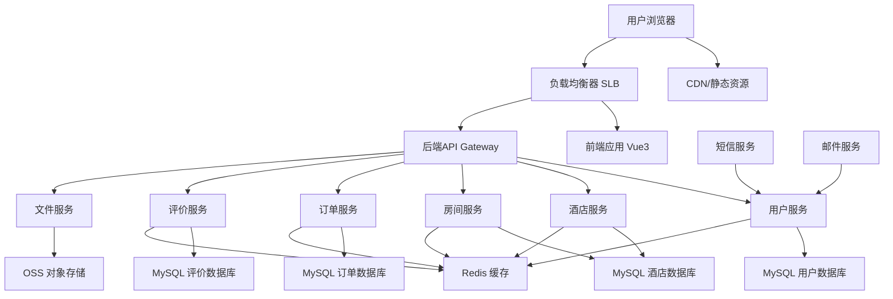
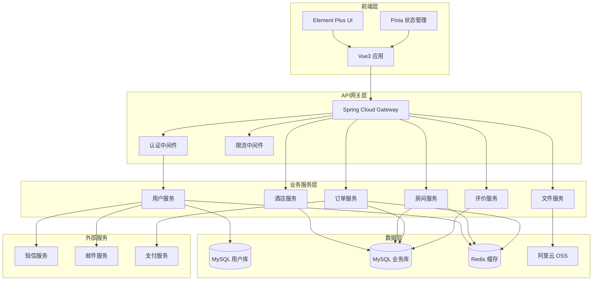
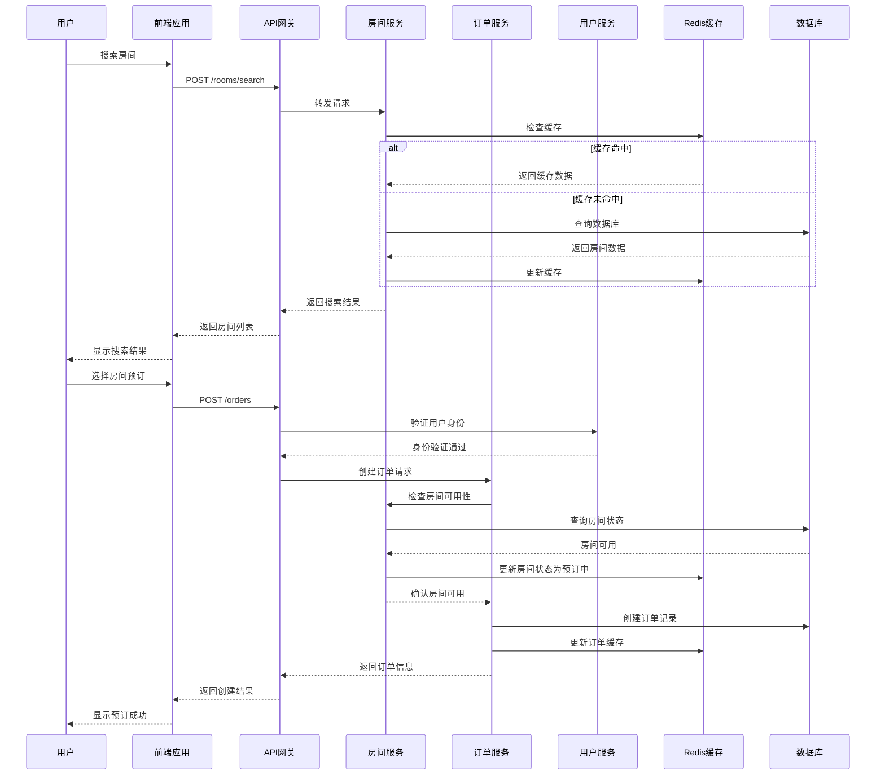
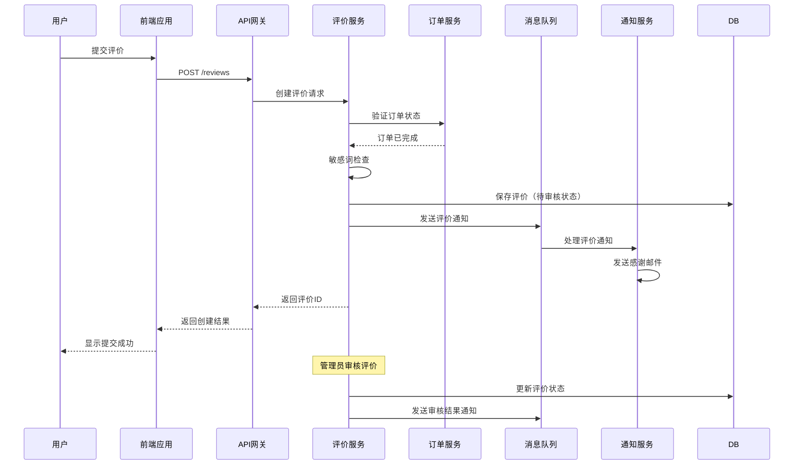
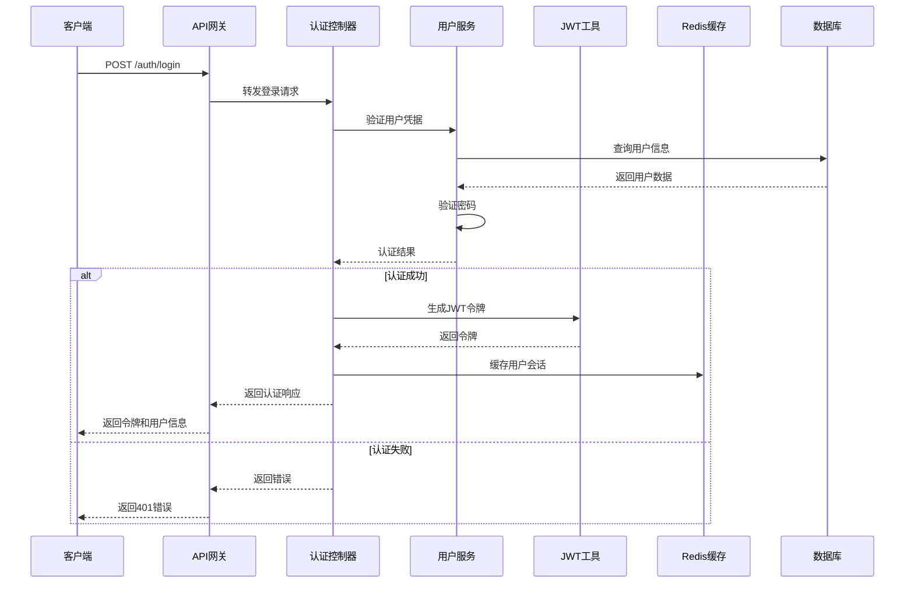
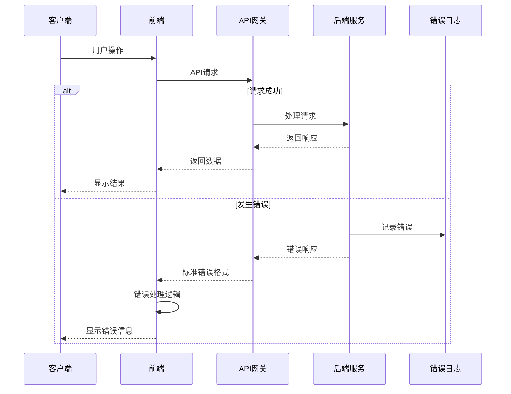

# 成都酒店综合管理系统 Fullstack Architecture Document

## 介绍

本文档概述了成都酒店综合管理系统的完整全栈架构，包括后端系统、前端实现及其集成。它作为AI驱动开发的单一事实来源，确保整个技术栈的一致性。

这种统一的方法结合了传统上分离的后端和前端架构文档，简化了现代全栈应用的开发流程，因为这些关注点日益紧密交织。

### 启动模板或现有项目

根据PRD要求，这是一个绿地项目，基于指定的技术栈：
- **前端：** Vue3 + TypeScript + Element Plus UI框架
- **后端：** Spring Boot 2.7+ + MyBatis Plus + MySQL 8.0
- **架构模式：** 微服务架构，初期采用单体应用快速开发
- **部署：** Docker容器化 + 阿里云基础设施

### 变更日志
| 日期 | 版本 | 描述 | 作者 |
|------|------|------|------|
| 2025-12-06 | v1.0 | 初始全栈架构版本创建 | Winston (Architect) |

## 高层架构

### 技术摘要

本项目采用现代化的全栈架构，结合Vue3前端框架和Spring Boot后端微服务架构。前端使用组件化设计和TypeScript确保类型安全，后端采用微服务模式支持未来扩展。系统通过RESTful API进行通信，使用MySQL作为主数据库，Redis作为缓存层。部署采用Docker容器化策略，配合阿里云服务提供可靠的基础设施支持。

### 平台和基础设施选择

基于PRD性能要求（1000并发用户、99.5%可用性）和技术偏好，推荐以下平台：

**推荐选择：阿里云全栈解决方案**
- **优势：** 本土化服务、稳定可靠、完整的技术栈支持
- **成本效益：** 符合项目预算，提供免费试用额度
- **技术支持：** 丰富的文档和中文技术支持

**平台：** 阿里云
**核心服务：** ECS服务器、RDS数据库、OSS存储、Redis缓存、SLB负载均衡
**部署主机和区域：** 华东1（杭州）区域，提供稳定的网络连接

### 仓库结构

**结构：** Monorepo单体仓库
**Monorepo工具：** npm workspaces（轻量级，适合项目规模）
**包组织策略：**
- apps/：应用包（前端、后端）
- packages/：共享包（类型定义、工具函数）
- infrastructure/：基础设施代码
- docs/：项目文档

### 高层架构图



### 架构模式

- **微服务架构：** 后端采用微服务模式，每个业务域独立部署和扩展
- **组件化UI：** 前端使用Vue3组件化开发，提高代码复用和维护性
- **Repository模式：** 抽象数据访问逻辑，支持测试和数据库迁移灵活性
- **API网关模式：** 统一入口点，集中认证、限流和监控
- **CQRS模式：** 命令查询责任分离，优化复杂查询性能
- **事件驱动架构：** 服务间通过异步事件通信，提高系统解耦
- **缓存策略：** 多层缓存设计，提升系统响应速度

## 技术栈

### 技术栈表格

| 类别 | 技术 | 版本 | 用途 | 选择理由 |
|------|------|------|------|----------|
| 前端语言 | TypeScript | 5.0+ | 类型安全的JavaScript开发 | 提供类型检查，减少运行时错误，改善开发体验 |
| 前端框架 | Vue 3 | 3.3+ | 构建用户界面 | 现代化响应式框架，Composition API提供更好的代码组织 |
| UI组件库 | Element Plus | 2.4+ | 企业级UI组件库 | 丰富的组件生态，适合管理后台，中文文档完善 |
| 状态管理 | Pinia | 2.1+ | Vue应用状态管理 | Vue3官方推荐，TypeScript支持良好，API简洁 |
| 后端语言 | Java | 17 | 后端服务开发 | 企业级语言，生态成熟，Spring Boot官方支持 |
| 后端框架 | Spring Boot | 2.7+ | 微服务框架 | 简化Spring配置，内嵌容器，生产就绪特性 |
| API风格 | REST API | OpenAPI 3.0 | 前后端通信 | 标准化、无状态、易于理解和测试 |
| 数据库 | MySQL | 8.0+ | 主数据存储 | 成熟稳定，事务支持完善，JSON字段支持 |
| 缓存 | Redis | 7.0+ | 缓存和会话存储 | 高性能，数据结构丰富，持久化支持 |
| 文件存储 | 阿里云OSS | - | 图片文件存储 | 高可用，CDN加速，成本低廉 |
| 认证 | JWT | 0.11+ | 无状态身份认证 | 跨域支持，无状态，移动端友好 |
| 前端测试 | Vitest + Vue Test Utils | 1.0+ | 单元测试和集成测试 | 快速，现代，与Vue3深度集成 |
| 后端测试 | JUnit 5 + Mockito | 5.9+ | 单元测试和集成测试 | Java生态标准，Spring Boot内置支持 |
| E2E测试 | Playwright | 1.40+ | 端到端测试 | 跨浏览器支持，现代API，可靠稳定 |
| 构建工具 | Vite | 5.0+ | 前端构建工具 | 快速热更新，现代化，插件生态丰富 |
| 打包器 | Vite | 5.0+ | 前端资源打包 | 内置打包，优化配置简单 |
| 基础设施即代码 | Docker | 24.0+ | 容器化部署 | 环境一致性，简化部署流程 |
| CI/CD | GitHub Actions | - | 持续集成部署 | 与GitHub集成，免费额度，配置灵活 |
| 监控 | 阿里云ARMS | - | 应用性能监控 | 阿里云原生集成，全链路追踪 |
| 日志 | 阿里云SLS | - | 日志收集分析 | 实时日志，搜索分析，告警功能 |
| CSS框架 | SCSS | 1.69+ | 样式预处理器 | 变量、嵌套、混入，提高样式复用性 |

## 数据模型

### 用户模型 (User)

**用途：** 存储用户基本信息和认证数据

**关键属性：**
- id: Long - 用户唯一标识
- username: String - 用户名
- email: String - 邮箱地址
- phone: String - 手机号码
- password: String - 加密密码
- role: UserRole - 用户角色（USER/ADMIN）
- status: UserStatus - 用户状态（ACTIVE/INACTIVE）
- createdAt: LocalDateTime - 创建时间
- updatedAt: LocalDateTime - 更新时间

#### TypeScript接口

```typescript
interface User {
  id: number;
  username: string;
  email: string;
  phone: string;
  role: 'USER' | 'ADMIN';
  status: 'ACTIVE' | 'INACTIVE';
  createdAt: string;
  updatedAt: string;
}

interface CreateUserRequest {
  username: string;
  email: string;
  phone: string;
  password: string;
  role?: 'USER' | 'ADMIN';
}
```

#### 关系
- 一对多：用户可以创建多个订单
- 一对多：用户可以提交多个评价

### 酒店模型 (Hotel)

**用途：** 存储酒店基本信息和配置

**关键属性：**
- id: Long - 酒店唯一标识
- name: String - 酒店名称
- address: String - 酒店地址
- phone: String - 联系电话
- description: String - 酒店描述
- facilities: String - 设施信息（JSON格式）
- images: String - 酒店图片（JSON数组）
- status: HotelStatus - 酒店状态
- createdBy: Long - 创建者ID
- createdAt: LocalDateTime - 创建时间
- updatedAt: LocalDateTime - 更新时间

#### TypeScript接口

```typescript
interface Hotel {
  id: number;
  name: string;
  address: string;
  phone: string;
  description: string;
  facilities: string[];
  images: string[];
  status: 'ACTIVE' | 'INACTIVE';
  createdBy: number;
  createdAt: string;
  updatedAt: string;
}
```

#### 关系
- 一对多：酒店包含多个房间类型
- 一对多：酒店拥有多个房间

### 房间类型模型 (RoomType)

**用途：** 定义房间类别和基础价格

**关键属性：**
- id: Long - 房间类型唯一标识
- hotelId: Long - 所属酒店ID
- name: String - 房间类型名称
- capacity: Integer - 可容纳人数
- basePrice: BigDecimal - 基础价格
- facilities: String - 设施列表（JSON格式）
- description: String - 类型描述
- createdAt: LocalDateTime - 创建时间

#### TypeScript接口

```typescript
interface RoomType {
  id: number;
  hotelId: number;
  name: string;
  capacity: number;
  basePrice: number;
  facilities: string[];
  description: string;
  createdAt: string;
}
```

#### 关系
- 多对一：属于一个酒店
- 一对多：包含多个具体房间

### 房间模型 (Room)

**用途：** 存储具体房间信息和状态

**关键属性：**
- id: Long - 房间唯一标识
- hotelId: Long - 所属酒店ID
- roomTypeId: Long - 房间类型ID
- roomNumber: String - 房间号
- floor: Integer - 所在楼层
- area: Integer - 房间面积（平方米）
- status: RoomStatus - 房间状态
- price: BigDecimal - 当前价格
- images: String - 房间图片（JSON数组）
- createdAt: LocalDateTime - 创建时间
- updatedAt: LocalDateTime - 更新时间

#### TypeScript接口

```typescript
interface Room {
  id: number;
  hotelId: number;
  roomTypeId: number;
  roomNumber: string;
  floor: number;
  area: number;
  status: 'AVAILABLE' | 'OCCUPIED' | 'MAINTENANCE' | 'CLEANING';
  price: number;
  images: string[];
  createdAt: string;
  updatedAt: string;
}
```

#### 关系
- 多对一：属于一个酒店
- 多对一：属于一个房间类型
- 一对多：关联多个订单

### 订单模型 (Order)

**用途：** 存储预订订单信息

**关键属性：**
- id: Long - 订单唯一标识
- orderNumber: String - 订单号
- userId: Long - 用户ID
- roomId: Long - 房间ID
- checkInDate: LocalDate - 入住日期
- checkOutDate: LocalDate - 退房日期
- guestCount: Integer - 住宿人数
- totalPrice: BigDecimal - 总价格
- status: OrderStatus - 订单状态
- specialRequests: String - 特殊要求
- createdAt: LocalDateTime - 创建时间
- updatedAt: LocalDateTime - 更新时间

#### TypeScript接口

```typescript
interface Order {
  id: number;
  orderNumber: string;
  userId: number;
  roomId: number;
  checkInDate: string;
  checkOutDate: string;
  guestCount: number;
  totalPrice: number;
  status: 'PENDING' | 'CONFIRMED' | 'CANCELLED' | 'COMPLETED';
  specialRequests?: string;
  createdAt: string;
  updatedAt: string;
}
```

#### 关系
- 多对一：属于一个用户
- 多对一：关联一个房间

### 评价模型 (Review)

**用途：** 存储用户评价信息

**关键属性：**
- id: Long - 评价唯一标识
- userId: Long - 用户ID
- orderId: Long - 关联订单ID
- roomId: Long - 房间ID
- hotelId: Long - 酒店ID
- overallRating: Integer - 总体评分（1-5）
- cleanlinessRating: Integer - 清洁度评分
- serviceRating: Integer - 服务评分
- facilitiesRating: Integer - 设施评分
- locationRating: Integer - 位置评分
- comment: String - 评价内容
- images: String - 评价图片（JSON数组）
- isAnonymous: Boolean - 是否匿名
- status: ReviewStatus - 评价状态
- createdAt: LocalDateTime - 创建时间

#### TypeScript接口

```typescript
interface Review {
  id: number;
  userId: number;
  orderId: number;
  roomId: number;
  hotelId: number;
  overallRating: number;
  cleanlinessRating: number;
  serviceRating: number;
  facilitiesRating: number;
  locationRating: number;
  comment: string;
  images: string[];
  isAnonymous: boolean;
  status: 'PENDING' | 'APPROVED' | 'REJECTED';
  createdAt: string;
}
```

#### 关系
- 多对一：属于一个用户
- 多对一：关联一个订单
- 多对一：关联一个房间
- 多对一：属于一个酒店

## API规格

### REST API规格

```yaml
openapi: 3.0.0
info:
  title: 成都酒店综合管理系统 API
  version: 1.0.0
  description: 为成都酒店管理系统提供的RESTful API接口
servers:
  - url: https://api.chengdu-hotel.com/v1
    description: 生产环境
  - url: https://staging-api.chengdu-hotel.com/v1
    description: 测试环境
  - url: http://localhost:8080/v1
    description: 开发环境

paths:
  # 用户认证相关
  /auth/register:
    post:
      tags: [认证]
      summary: 用户注册
      requestBody:
        required: true
        content:
          application/json:
            schema:
              $ref: '#/components/schemas/CreateUserRequest'
      responses:
        '201':
          description: 注册成功
          content:
            application/json:
              schema:
                $ref: '#/components/schemas/AuthResponse'
        '400':
          $ref: '#/components/responses/BadRequest'

  /auth/login:
    post:
      tags: [认证]
      summary: 用户登录
      requestBody:
        required: true
        content:
          application/json:
            schema:
              $ref: '#/components/schemas/LoginRequest'
      responses:
        '200':
          description: 登录成功
          content:
            application/json:
              schema:
                $ref: '#/components/schemas/AuthResponse'
        '401':
          $ref: '#/components/responses/Unauthorized'

  /auth/logout:
    post:
      tags: [认证]
      summary: 用户登出
      security:
        - bearerAuth: []
      responses:
        '200':
          description: 登出成功

  # 用户管理
  /users/me:
    get:
      tags: [用户]
      summary: 获取当前用户信息
      security:
        - bearerAuth: []
      responses:
        '200':
          description: 用户信息
          content:
            application/json:
              schema:
                $ref: '#/components/schemas/User'
    put:
      tags: [用户]
      summary: 更新当前用户信息
      security:
        - bearerAuth: []
      requestBody:
        required: true
        content:
          application/json:
            schema:
              $ref: '#/components/schemas/UpdateUserRequest'
      responses:
        '200':
          description: 更新成功
          content:
            application/json:
              schema:
                $ref: '#/components/schemas/User'

  # 酒店管理
  /hotels:
    get:
      tags: [酒店]
      summary: 获取酒店列表
      parameters:
        - name: page
          in: query
          schema:
            type: integer
            default: 0
        - name: size
          in: query
          schema:
            type: integer
            default: 20
      responses:
        '200':
          description: 酒店列表
          content:
            application/json:
              schema:
                $ref: '#/components/schemas/HotelListResponse'
    post:
      tags: [酒店]
      summary: 创建酒店
      security:
        - bearerAuth: []
      requestBody:
        required: true
        content:
          application/json:
            schema:
              $ref: '#/components/schemas/CreateHotelRequest'
      responses:
        '201':
          description: 创建成功
          content:
            application/json:
              schema:
                $ref: '#/components/schemas/Hotel'

  /hotels/{id}:
    get:
      tags: [酒店]
      summary: 获取酒店详情
      parameters:
        - name: id
          in: path
          required: true
          schema:
            type: integer
      responses:
        '200':
          description: 酒店详情
          content:
            application/json:
              schema:
                $ref: '#/components/schemas/Hotel'
    put:
      tags: [酒店]
      summary: 更新酒店信息
      security:
        - bearerAuth: []
      parameters:
        - name: id
          in: path
          required: true
          schema:
            type: integer
      requestBody:
        required: true
        content:
          application/json:
            schema:
              $ref: '#/components/schemas/UpdateHotelRequest'
      responses:
        '200':
          description: 更新成功
          content:
            application/json:
              schema:
                $ref: '#/components/schemas/Hotel'

  # 房间管理
  /hotels/{hotelId}/rooms:
    get:
      tags: [房间]
      summary: 获取酒店房间列表
      parameters:
        - name: hotelId
          in: path
          required: true
          schema:
            type: integer
        - name: roomTypeId
          in: query
          schema:
            type: integer
        - name: status
          in: query
          schema:
            type: string
            enum: [AVAILABLE, OCCUPIED, MAINTENANCE, CLEANING]
      responses:
        '200':
          description: 房间列表
          content:
            application/json:
              schema:
                $ref: '#/components/schemas/RoomListResponse'

  /rooms/{id}:
    get:
      tags: [房间]
      summary: 获取房间详情
      parameters:
        - name: id
          in: path
          required: true
          schema:
            type: integer
      responses:
        '200':
          description: 房间详情
          content:
            application/json:
              schema:
                $ref: '#/components/schemas/Room'

  # 房间搜索
  /rooms/search:
    post:
      tags: [房间]
      summary: 搜索可用房间
      requestBody:
        required: true
        content:
          application/json:
            schema:
              $ref: '#/components/schemas/RoomSearchRequest'
      responses:
        '200':
          description: 搜索结果
          content:
            application/json:
              schema:
                $ref: '#/components/schemas/RoomSearchResponse'

  # 订单管理
  /orders:
    get:
      tags: [订单]
      summary: 获取用户订单列表
      security:
        - bearerAuth: []
      parameters:
        - name: status
          in: query
          schema:
            type: string
            enum: [PENDING, CONFIRMED, CANCELLED, COMPLETED]
      responses:
        '200':
          description: 订单列表
          content:
            application/json:
              schema:
                $ref: '#/components/schemas/OrderListResponse'
    post:
      tags: [订单]
      summary: 创建订单
      security:
        - bearerAuth: []
      requestBody:
        required: true
        content:
          application/json:
            schema:
              $ref: '#/components/schemas/CreateOrderRequest'
      responses:
        '201':
          description: 创建成功
          content:
            application/json:
              schema:
                $ref: '#/components/schemas/Order'

  /orders/{id}:
    get:
      tags: [订单]
      summary: 获取订单详情
      security:
        - bearerAuth: []
      parameters:
        - name: id
          in: path
          required: true
          schema:
            type: integer
      responses:
        '200':
          description: 订单详情
          content:
            application/json:
              schema:
                $ref: '#/components/schemas/Order'
    put:
      tags: [订单]
      summary: 更新订单
      security:
        - bearerAuth: []
      parameters:
        - name: id
          in: path
          required: true
          schema:
            type: integer
      requestBody:
        required: true
        content:
          application/json:
            schema:
              $ref: '#/components/schemas/UpdateOrderRequest'
      responses:
        '200':
          description: 更新成功
          content:
            application/json:
              schema:
                $ref: '#/components/schemas/Order'
    delete:
      tags: [订单]
      summary: 取消订单
      security:
        - bearerAuth: []
      parameters:
        - name: id
          in: path
          required: true
          schema:
            type: integer
      responses:
        '200':
          description: 取消成功

  # 评价管理
  /reviews:
    get:
      tags: [评价]
      summary: 获取评价列表
      parameters:
        - name: hotelId
          in: query
          schema:
            type: integer
        - name: roomId
          in: query
          schema:
            type: integer
        - name: rating
          in: query
          schema:
            type: integer
            minimum: 1
            maximum: 5
      responses:
        '200':
          description: 评价列表
          content:
            application/json:
              schema:
                $ref: '#/components/schemas/ReviewListResponse'
    post:
      tags: [评价]
      summary: 提交评价
      security:
        - bearerAuth: []
      requestBody:
        required: true
        content:
          application/json:
            schema:
              $ref: '#/components/schemas/CreateReviewRequest'
      responses:
        '201':
          description: 提交成功
          content:
            application/json:
              schema:
                $ref: '#/components/schemas/Review'

  /reviews/{id}:
    get:
      tags: [评价]
      summary: 获取评价详情
      parameters:
        - name: id
          in: path
          required: true
          schema:
            type: integer
      responses:
        '200':
          description: 评价详情
          content:
            application/json:
              schema:
                $ref: '#/components/schemas/Review'

components:
  schemas:
    User:
      type: object
      properties:
        id:
          type: integer
          format: int64
        username:
          type: string
        email:
          type: string
          format: email
        phone:
          type: string
        role:
          type: string
          enum: [USER, ADMIN]
        status:
          type: string
          enum: [ACTIVE, INACTIVE]
        createdAt:
          type: string
          format: date-time
        updatedAt:
          type: string
          format: date-time

    CreateUserRequest:
      type: object
      required: [username, email, phone, password]
      properties:
        username:
          type: string
          minLength: 3
          maxLength: 50
        email:
          type: string
          format: email
        phone:
          type: string
          pattern: '^1[3-9]\d{9}$'
        password:
          type: string
          minLength: 8
        role:
          type: string
          enum: [USER, ADMIN]
          default: USER

    LoginRequest:
      type: object
      required: [login, password]
      properties:
        login:
          type: string
          description: 用户名、邮箱或手机号
        password:
          type: string

    AuthResponse:
      type: object
      properties:
        token:
          type: string
        user:
          $ref: '#/components/schemas/User'
        expiresIn:
          type: integer
          description: 令牌过期时间（秒）

    Hotel:
      type: object
      properties:
        id:
          type: integer
          format: int64
        name:
          type: string
        address:
          type: string
        phone:
          type: string
        description:
          type: string
        facilities:
          type: array
          items:
            type: string
        images:
          type: array
          items:
            type: string
        status:
          type: string
          enum: [ACTIVE, INACTIVE]
        createdBy:
          type: integer
          format: int64
        createdAt:
          type: string
          format: date-time
        updatedAt:
          type: string
          format: date-time

    Room:
      type: object
      properties:
        id:
          type: integer
          format: int64
        hotelId:
          type: integer
          format: int64
        roomTypeId:
          type: integer
          format: int64
        roomNumber:
          type: string
        floor:
          type: integer
        area:
          type: integer
        status:
          type: string
          enum: [AVAILABLE, OCCUPIED, MAINTENANCE, CLEANING]
        price:
          type: number
          format: decimal
        images:
          type: array
          items:
            type: string
        createdAt:
          type: string
          format: date-time
        updatedAt:
          type: string
          format: date-time

    Order:
      type: object
      properties:
        id:
          type: integer
          format: int64
        orderNumber:
          type: string
        userId:
          type: integer
          format: int64
        roomId:
          type: integer
          format: int64
        checkInDate:
          type: string
          format: date
        checkOutDate:
          type: string
          format: date
        guestCount:
          type: integer
          minimum: 1
          maximum: 10
        totalPrice:
          type: number
          format: decimal
        status:
          type: string
          enum: [PENDING, CONFIRMED, CANCELLED, COMPLETED]
        specialRequests:
          type: string
        createdAt:
          type: string
          format: date-time
        updatedAt:
          type: string
          format: date-time

    Review:
      type: object
      properties:
        id:
          type: integer
          format: int64
        userId:
          type: integer
          format: int64
        orderId:
          type: integer
          format: int64
        roomId:
          type: integer
          format: int64
        hotelId:
          type: integer
          format: int64
        overallRating:
          type: integer
          minimum: 1
          maximum: 5
        cleanlinessRating:
          type: integer
          minimum: 1
          maximum: 5
        serviceRating:
          type: integer
          minimum: 1
          maximum: 5
        facilitiesRating:
          type: integer
          minimum: 1
          maximum: 5
        locationRating:
          type: integer
          minimum: 1
          maximum: 5
        comment:
          type: string
          maxLength: 1000
        images:
          type: array
          items:
            type: string
        isAnonymous:
          type: boolean
        status:
          type: string
          enum: [PENDING, APPROVED, REJECTED]
        createdAt:
          type: string
          format: date-time

    RoomSearchRequest:
      type: object
      required: [checkInDate, checkOutDate, guestCount]
      properties:
        hotelId:
          type: integer
          format: int64
        roomTypeId:
          type: integer
          format: int64
        checkInDate:
          type: string
          format: date
        checkOutDate:
          type: string
          format: date
        guestCount:
          type: integer
          minimum: 1
        priceMin:
          type: number
          format: decimal
        priceMax:
          type: number
          format: decimal

    RoomSearchResponse:
      type: object
      properties:
        rooms:
          type: array
          items:
            $ref: '#/components/schemas/Room'
        total:
          type: integer
        page:
          type: integer
        size:
          type: integer

  responses:
    BadRequest:
      description: 请求参数错误
      content:
        application/json:
          schema:
            type: object
            properties:
              error:
                type: object
                properties:
                  code:
                    type: string
                  message:
                    type: string
                  timestamp:
                    type: string
                    format: date-time
                  requestId:
                    type: string

    Unauthorized:
      description: 认证失败
      content:
        application/json:
          schema:
            $ref: '#/components/responses/BadRequest'

  securitySchemes:
    bearerAuth:
      type: http
      scheme: bearer
      bearerFormat: JWT
```

## 组件

### 用户服务 (User Service)

**职责：** 处理用户注册、登录、认证和用户信息管理

**关键接口：**
- POST /auth/register - 用户注册
- POST /auth/login - 用户登录
- GET /users/me - 获取当前用户信息
- PUT /users/me - 更新用户信息
- POST /auth/logout - 用户登出

**依赖：** MySQL数据库、Redis缓存、短信服务、邮件服务

**技术栈：** Spring Boot + Spring Security + JWT + MyBatis Plus

### 酒店服务 (Hotel Service)

**职责：** 管理酒店信息、设施配置和基础数据

**关键接口：**
- GET /hotels - 获取酒店列表
- POST /hotels - 创建酒店
- GET /hotels/{id} - 获取酒店详情
- PUT /hotels/{id} - 更新酒店信息
- DELETE /hotels/{id} - 删除酒店

**依赖：** MySQL数据库、OSS对象存储

**技术栈：** Spring Boot + MyBatis Plus + 阿里云OSS

### 房间服务 (Room Service)

**职责：** 管理房间信息、房间类型和库存状态

**关键接口：**
- GET /hotels/{hotelId}/rooms - 获取酒店房间列表
- POST /rooms/search - 搜索可用房间
- GET /rooms/{id} - 获取房间详情
- PUT /rooms/{id} - 更新房间状态
- POST /room-types - 创建房间类型

**依赖：** MySQL数据库、Redis缓存（房间状态缓存）

**技术栈：** Spring Boot + MyBatis Plus + Redis

### 订单服务 (Order Service)

**职责：** 处理预订订单、订单状态管理和支付集成

**关键接口：**
- GET /orders - 获取用户订单列表
- POST /orders - 创建订单
- GET /orders/{id} - 获取订单详情
- PUT /orders/{id} - 更新订单
- DELETE /orders/{id} - 取消订单

**依赖：** MySQL数据库、Redis缓存、支付服务（未来扩展）

**技术栈：** Spring Boot + MyBatis Plus + 分布式锁

### 评价服务 (Review Service)

**职责：** 管理用户评价、评分统计和评价审核

**关键接口：**
- GET /reviews - 获取评价列表
- POST /reviews - 提交评价
- GET /reviews/{id} - 获取评价详情
- PUT /reviews/{id}/status - 更新评价状态
- GET /reviews/statistics/{hotelId} - 获取酒店评价统计

**依赖：** MySQL数据库、消息队列（异步处理）

**技术栈：** Spring Boot + MyBatis Plus + RabbitMQ

### 文件服务 (File Service)

**职责：** 处理文件上传、存储和访问控制

**关键接口：**
- POST /files/upload - 文件上传
- GET /files/{id} - 文件访问
- DELETE /files/{id} - 删除文件
- POST /files/batch - 批量文件操作

**依赖：** 阿里云OSS、CDN

**技术栈：** Spring Boot + 阿里云OSS SDK

### 组件图



## 核心工作流

### 用户预订流程



### 用户评价流程



## 数据库架构

### 数据库设计

```sql
-- 用户表
CREATE TABLE users (
    id BIGINT AUTO_INCREMENT PRIMARY KEY,
    username VARCHAR(50) NOT NULL UNIQUE,
    email VARCHAR(100) NOT NULL UNIQUE,
    phone VARCHAR(20) NOT NULL UNIQUE,
    password VARCHAR(255) NOT NULL,
    role ENUM('USER', 'ADMIN') NOT NULL DEFAULT 'USER',
    status ENUM('ACTIVE', 'INACTIVE') NOT NULL DEFAULT 'ACTIVE',
    created_at TIMESTAMP DEFAULT CURRENT_TIMESTAMP,
    updated_at TIMESTAMP DEFAULT CURRENT_TIMESTAMP ON UPDATE CURRENT_TIMESTAMP,
    INDEX idx_username (username),
    INDEX idx_email (email),
    INDEX idx_phone (phone)
);

-- 酒店表
CREATE TABLE hotels (
    id BIGINT AUTO_INCREMENT PRIMARY KEY,
    name VARCHAR(100) NOT NULL,
    address VARCHAR(255) NOT NULL,
    phone VARCHAR(20) NOT NULL,
    description TEXT,
    facilities JSON,
    images JSON,
    status ENUM('ACTIVE', 'INACTIVE') NOT NULL DEFAULT 'ACTIVE',
    created_by BIGINT NOT NULL,
    created_at TIMESTAMP DEFAULT CURRENT_TIMESTAMP,
    updated_at TIMESTAMP DEFAULT CURRENT_TIMESTAMP ON UPDATE CURRENT_TIMESTAMP,
    FOREIGN KEY (created_by) REFERENCES users(id),
    INDEX idx_status (status),
    INDEX idx_created_by (created_by)
);

-- 房间类型表
CREATE TABLE room_types (
    id BIGINT AUTO_INCREMENT PRIMARY KEY,
    hotel_id BIGINT NOT NULL,
    name VARCHAR(50) NOT NULL,
    capacity INT NOT NULL,
    base_price DECIMAL(10,2) NOT NULL,
    facilities JSON,
    description TEXT,
    created_at TIMESTAMP DEFAULT CURRENT_TIMESTAMP,
    FOREIGN KEY (hotel_id) REFERENCES hotels(id) ON DELETE CASCADE,
    INDEX idx_hotel_id (hotel_id)
);

-- 房间表
CREATE TABLE rooms (
    id BIGINT AUTO_INCREMENT PRIMARY KEY,
    hotel_id BIGINT NOT NULL,
    room_type_id BIGINT NOT NULL,
    room_number VARCHAR(20) NOT NULL,
    floor INT NOT NULL,
    area INT NOT NULL,
    status ENUM('AVAILABLE', 'OCCUPIED', 'MAINTENANCE', 'CLEANING') NOT NULL DEFAULT 'AVAILABLE',
    price DECIMAL(10,2) NOT NULL,
    images JSON,
    created_at TIMESTAMP DEFAULT CURRENT_TIMESTAMP,
    updated_at TIMESTAMP DEFAULT CURRENT_TIMESTAMP ON UPDATE CURRENT_TIMESTAMP,
    FOREIGN KEY (hotel_id) REFERENCES hotels(id) ON DELETE CASCADE,
    FOREIGN KEY (room_type_id) REFERENCES room_types(id) ON DELETE CASCADE,
    UNIQUE KEY uk_hotel_room (hotel_id, room_number),
    INDEX idx_status (status),
    INDEX idx_room_type_id (room_type_id)
);

-- 订单表
CREATE TABLE orders (
    id BIGINT AUTO_INCREMENT PRIMARY KEY,
    order_number VARCHAR(50) NOT NULL UNIQUE,
    user_id BIGINT NOT NULL,
    room_id BIGINT NOT NULL,
    check_in_date DATE NOT NULL,
    check_out_date DATE NOT NULL,
    guest_count INT NOT NULL,
    total_price DECIMAL(10,2) NOT NULL,
    status ENUM('PENDING', 'CONFIRMED', 'CANCELLED', 'COMPLETED') NOT NULL DEFAULT 'PENDING',
    special_requests TEXT,
    created_at TIMESTAMP DEFAULT CURRENT_TIMESTAMP,
    updated_at TIMESTAMP DEFAULT CURRENT_TIMESTAMP ON UPDATE CURRENT_TIMESTAMP,
    FOREIGN KEY (user_id) REFERENCES users(id),
    FOREIGN KEY (room_id) REFERENCES rooms(id),
    INDEX idx_user_id (user_id),
    INDEX idx_room_id (room_id),
    INDEX idx_status (status),
    INDEX idx_check_dates (check_in_date, check_out_date)
);

-- 评价表
CREATE TABLE reviews (
    id BIGINT AUTO_INCREMENT PRIMARY KEY,
    user_id BIGINT NOT NULL,
    order_id BIGINT NOT NULL,
    room_id BIGINT NOT NULL,
    hotel_id BIGINT NOT NULL,
    overall_rating INT NOT NULL CHECK (overall_rating BETWEEN 1 AND 5),
    cleanliness_rating INT NOT NULL CHECK (cleanliness_rating BETWEEN 1 AND 5),
    service_rating INT NOT NULL CHECK (service_rating BETWEEN 1 AND 5),
    facilities_rating INT NOT NULL CHECK (facilities_rating BETWEEN 1 AND 5),
    location_rating INT NOT NULL CHECK (location_rating BETWEEN 1 AND 5),
    comment TEXT,
    images JSON,
    is_anonymous BOOLEAN NOT NULL DEFAULT FALSE,
    status ENUM('PENDING', 'APPROVED', 'REJECTED') NOT NULL DEFAULT 'PENDING',
    created_at TIMESTAMP DEFAULT CURRENT_TIMESTAMP,
    FOREIGN KEY (user_id) REFERENCES users(id),
    FOREIGN KEY (order_id) REFERENCES orders(id),
    FOREIGN KEY (room_id) REFERENCES rooms(id),
    FOREIGN KEY (hotel_id) REFERENCES hotels(id),
    UNIQUE KEY uk_order_review (order_id),
    INDEX idx_user_id (user_id),
    INDEX idx_hotel_id (hotel_id),
    INDEX idx_status (status),
    INDEX idx_overall_rating (overall_rating)
);

-- 创建索引优化查询性能
CREATE INDEX idx_orders_hotel_dates ON orders(hotel_id, check_in_date, check_out_date);
CREATE INDEX idx_reviews_hotel_rating ON reviews(hotel_id, overall_rating);
```

## 前端架构

### 组件架构

#### 组件组织

```
src/
├── components/           # 通用组件
│   ├── common/          # 基础组件
│   │   ├── Button/
│   │   ├── Input/
│   │   ├── Modal/
│   │   └── Loading/
│   ├── business/        # 业务组件
│   │   ├── RoomCard/
│   │   ├── OrderStatus/
│   │   └── RatingStars/
│   └── layout/          # 布局组件
│       ├── Header/
│       ├── Sidebar/
│       └── Footer/
├── pages/               # 页面组件
│   ├── auth/           # 认证页面
│   ├── hotels/         # 酒店相关页面
│   ├── rooms/          # 房间相关页面
│   ├── orders/         # 订单相关页面
│   ├── reviews/        # 评价相关页面
│   └── admin/          # 管理后台页面
├── hooks/              # 自定义 Hooks
├── services/           # API 服务
├── stores/             # Pinia 状态管理
├── utils/              # 工具函数
├── types/              # TypeScript 类型定义
└── styles/             # 全局样式
```

#### 组件模板

```vue
<template>
  <div class="room-card" :class="{ 'room-card--loading': loading }">
    <div class="room-card__image">
      
      <div class="room-card__status" :class="`room-card__status--${room.status.toLowerCase()}`">
        {{ getStatusText(room.status) }}
      </div>
    </div>

    <div class="room-card__content">
      <h3 class="room-card__title">{{ room.roomNumber }} - {{ room.roomTypeName }}</h3>
      <p class="room-card__info">楼层: {{ room.floor }} | 面积: {{ room.area }}㎡</p>
      <div class="room-card__facilities">
        <span v-for="facility in room.facilities" :key="facility" class="facility-tag">
          {{ facility }}
        </span>
      </div>

      <div class="room-card__footer">
        <div class="room-card__price">
          <span class="price-label">¥</span>
          <span class="price-value">{{ room.price }}</span>
          <span class="price-unit">/晚</span>
        </div>
        <el-button
          type="primary"
          :disabled="room.status !== 'AVAILABLE'"
          @click="handleBookRoom"
        >
          {{ room.status === 'AVAILABLE' ? '立即预订' : '不可预订' }}
        </el-button>
      </div>
    </div>
  </div>
</template>

<script setup lang="ts">
import { computed } from 'vue';
import type { Room } from '@/types/room';
import { useRoomStore } from '@/stores/room';

interface Props {
  room: Room;
  loading?: boolean;
}

interface Emits {
  (e: 'book', room: Room): void;
}

const props = withDefaults(defineProps<Props>(), {
  loading: false,
});

const emit = defineEmits<Emits>();

const roomStore = useRoomStore();

const getStatusText = (status: string) => {
  const statusMap = {
    AVAILABLE: '可预订',
    OCCUPIED: '已入住',
    MAINTENANCE: '维护中',
    CLEANING: '清洁中',
  };
  return statusMap[status] || status;
};

const handleBookRoom = () => {
  if (props.room.status === 'AVAILABLE') {
    emit('book', props.room);
  }
};
</script>

<style scoped lang="scss">
.room-card {
  border: 1px solid var(--border-color);
  border-radius: 8px;
  overflow: hidden;
  transition: all 0.3s ease;

  &:hover {
    box-shadow: 0 4px 12px rgba(0, 0, 0, 0.1);
    transform: translateY(-2px);
  }

  &--loading {
    opacity: 0.6;
    pointer-events: none;
  }

  &__image {
    position: relative;
    height: 200px;

    img {
      width: 100%;
      height: 100%;
      object-fit: cover;
    }
  }

  &__status {
    position: absolute;
    top: 8px;
    right: 8px;
    padding: 4px 8px;
    border-radius: 4px;
    font-size: 12px;
    font-weight: 500;

    &--available {
      background-color: var(--success-color);
      color: white;
    }

    &--occupied {
      background-color: var(--error-color);
      color: white;
    }

    &--maintenance {
      background-color: var(--warning-color);
      color: white;
    }

    &--cleaning {
      background-color: var(--info-color);
      color: white;
    }
  }

  &__content {
    padding: 16px;
  }

  &__title {
    margin: 0 0 8px;
    font-size: 18px;
    font-weight: 600;
  }

  &__info {
    margin: 0 0 12px;
    color: var(--text-secondary);
  }

  &__facilities {
    margin-bottom: 16px;

    .facility-tag {
      display: inline-block;
      padding: 2px 8px;
      margin: 0 4px 4px 0;
      background-color: var(--bg-secondary);
      border-radius: 12px;
      font-size: 12px;
    }
  }

  &__footer {
    display: flex;
    justify-content: space-between;
    align-items: center;
  }

  &__price {
    .price-label {
      font-size: 14px;
      color: var(--text-secondary);
    }

    .price-value {
      font-size: 24px;
      font-weight: 700;
      color: var(--primary-color);
    }

    .price-unit {
      font-size: 14px;
      color: var(--text-secondary);
    }
  }
}
</style>
```

### 状态管理架构

#### 状态结构

```typescript
// stores/auth.ts
export const useAuthStore = defineStore('auth', () => {
  const user = ref<User | null>(null);
  const token = ref<string>('');
  const isAuthenticated = computed(() => !!token.value);
  const isAdmin = computed(() => user.value?.role === 'ADMIN');

  const login = async (credentials: LoginRequest) => {
    const response = await authService.login(credentials);
    token.value = response.token;
    user.value = response.user;
    localStorage.setItem('token', response.token);
  };

  const logout = () => {
    token.value = '';
    user.value = null;
    localStorage.removeItem('token');
  };

  const checkAuth = async () => {
    const storedToken = localStorage.getItem('token');
    if (storedToken) {
      token.value = storedToken;
      try {
        user.value = await authService.getCurrentUser();
      } catch (error) {
        logout();
      }
    }
  };

  return {
    user: readonly(user),
    token: readonly(token),
    isAuthenticated,
    isAdmin,
    login,
    logout,
    checkAuth,
  };
});

// stores/room.ts
export const useRoomStore = defineStore('room', () => {
  const rooms = ref<Room[]>([]);
  const currentRoom = ref<Room | null>(null);
  const searchFilters = ref<RoomSearchFilters>({
    checkInDate: '',
    checkOutDate: '',
    guestCount: 1,
    hotelId: undefined,
    roomTypeId: undefined,
    priceMin: undefined,
    priceMax: undefined,
  });
  const loading = ref(false);
  const error = ref<string>('');

  const searchRooms = async (filters: RoomSearchFilters) => {
    loading.value = true;
    error.value = '';
    try {
      const response = await roomService.searchRooms(filters);
      rooms.value = response.rooms;
      searchFilters.value = { ...filters };
    } catch (err) {
      error.value = err instanceof Error ? err.message : '搜索失败';
      rooms.value = [];
    } finally {
      loading.value = false;
    }
  };

  const getRoomById = async (id: number) => {
    loading.value = true;
    try {
      const room = await roomService.getRoomById(id);
      currentRoom.value = room;
    } catch (err) {
      error.value = err instanceof Error ? err.message : '获取房间信息失败';
    } finally {
      loading.value = false;
    }
  };

  return {
    rooms: readonly(rooms),
    currentRoom: readonly(currentRoom),
    searchFilters: readonly(searchFilters),
    loading: readonly(loading),
    error: readonly(error),
    searchRooms,
    getRoomById,
  };
});
```

### 路由架构

#### 路由组织

```typescript
// router/index.ts
const routes = [
  {
    path: '/',
    redirect: '/home',
  },
  {
    path: '/auth',
    component: () => import('@/layouts/AuthLayout.vue'),
    children: [
      {
        path: 'login',
        name: 'Login',
        component: () => import('@/pages/auth/Login.vue'),
        meta: { title: '登录' },
      },
      {
        path: 'register',
        name: 'Register',
        component: () => import('@/pages/auth/Register.vue'),
        meta: { title: '注册' },
      },
    ],
  },
  {
    path: '/',
    component: () => import('@/layouts/MainLayout.vue'),
    meta: { requiresAuth: true },
    children: [
      {
        path: 'home',
        name: 'Home',
        component: () => import('@/pages/Home.vue'),
        meta: { title: '首页' },
      },
      {
        path: 'hotels',
        name: 'Hotels',
        component: () => import('@/pages/hotels/HotelList.vue'),
        meta: { title: '酒店列表' },
      },
      {
        path: 'hotels/:id',
        name: 'HotelDetail',
        component: () => import('@/pages/hotels/HotelDetail.vue'),
        meta: { title: '酒店详情' },
      },
      {
        path: 'rooms/search',
        name: 'RoomSearch',
        component: () => import('@/pages/rooms/RoomSearch.vue'),
        meta: { title: '房间搜索' },
      },
      {
        path: 'orders',
        name: 'Orders',
        component: () => import('@/pages/orders/OrderList.vue'),
        meta: { title: '我的订单', requiresAuth: true },
      },
      {
        path: 'orders/:id',
        name: 'OrderDetail',
        component: () => import('@/pages/orders/OrderDetail.vue'),
        meta: { title: '订单详情', requiresAuth: true },
      },
      {
        path: 'profile',
        name: 'Profile',
        component: () => import('@/pages/profile/Profile.vue'),
        meta: { title: '个人中心', requiresAuth: true },
      },
    ],
  },
  {
    path: '/admin',
    component: () => import('@/layouts/AdminLayout.vue'),
    meta: { requiresAuth: true, requiresAdmin: true },
    children: [
      {
        path: 'dashboard',
        name: 'AdminDashboard',
        component: () => import('@/pages/admin/Dashboard.vue'),
        meta: { title: '仪表板' },
      },
      {
        path: 'hotels',
        name: 'AdminHotels',
        component: () => import('@/pages/admin/hotels/HotelManagement.vue'),
        meta: { title: '酒店管理' },
      },
      {
        path: 'rooms',
        name: 'AdminRooms',
        component: () => import('@/pages/admin/rooms/RoomManagement.vue'),
        meta: { title: '房间管理' },
      },
      {
        path: 'orders',
        name: 'AdminOrders',
        component: () => import('@/pages/admin/orders/OrderManagement.vue'),
        meta: { title: '订单管理' },
      },
      {
        path: 'users',
        name: 'AdminUsers',
        component: () => import('@/pages/admin/users/UserManagement.vue'),
        meta: { title: '用户管理' },
      },
      {
        path: 'reviews',
        name: 'AdminReviews',
        component: () => import('@/pages/admin/reviews/ReviewManagement.vue'),
        meta: { title: '评价管理' },
      },
    ],
  },
  {
    path: '/:pathMatch(.*)*',
    name: 'NotFound',
    component: () => import('@/pages/NotFound.vue'),
    meta: { title: '页面不存在' },
  },
];
```

#### 受保护路由模式

```typescript
// router/guards.ts
router.beforeEach(async (to, from, next) => {
  const authStore = useAuthStore();

  // 检查是否需要认证
  if (to.meta.requiresAuth) {
    if (!authStore.isAuthenticated) {
      // 重定向到登录页面
      next({
        name: 'Login',
        query: { redirect: to.fullPath },
      });
      return;
    }

    // 检查是否需要管理员权限
    if (to.meta.requiresAdmin && !authStore.isAdmin) {
      next({ name: 'Home' });
      return;
    }
  }

  // 设置页面标题
  if (to.meta.title) {
    document.title = `${to.meta.title} - 成都酒店管理系统`;
  }

  next();
});
```

### 前端服务层

#### API客户端设置

```typescript
// services/api.ts
import axios, { AxiosInstance, AxiosRequestConfig, AxiosResponse } from 'axios';
import { useAuthStore } from '@/stores/auth';
import { ElMessage } from 'element-plus';

class ApiClient {
  private instance: AxiosInstance;

  constructor() {
    this.instance = axios.create({
      baseURL: import.meta.env.VITE_API_BASE_URL || 'http://localhost:8080/v1',
      timeout: 10000,
      headers: {
        'Content-Type': 'application/json',
      },
    });

    this.setupInterceptors();
  }

  private setupInterceptors() {
    // 请求拦截器
    this.instance.interceptors.request.use(
      (config) => {
        const authStore = useAuthStore();
        if (authStore.token) {
          config.headers.Authorization = `Bearer ${authStore.token}`;
        }
        return config;
      },
      (error) => {
        return Promise.reject(error);
      }
    );

    // 响应拦截器
    this.instance.interceptors.response.use(
      (response: AxiosResponse) => {
        return response;
      },
      (error) => {
        if (error.response?.status === 401) {
          const authStore = useAuthStore();
          authStore.logout();
          window.location.href = '/auth/login';
        } else if (error.response?.data?.error?.message) {
          ElMessage.error(error.response.data.error.message);
        } else {
          ElMessage.error('请求失败，请稍后重试');
        }
        return Promise.reject(error);
      }
    );
  }

  public get<T = any>(url: string, config?: AxiosRequestConfig): Promise<T> {
    return this.instance.get(url, config).then(response => response.data);
  }

  public post<T = any>(url: string, data?: any, config?: AxiosRequestConfig): Promise<T> {
    return this.instance.post(url, data, config).then(response => response.data);
  }

  public put<T = any>(url: string, data?: any, config?: AxiosRequestConfig): Promise<T> {
    return this.instance.put(url, data, config).then(response => response.data);
  }

  public delete<T = any>(url: string, config?: AxiosRequestConfig): Promise<T> {
    return this.instance.delete(url, config).then(response => response.data);
  }
}

export const apiClient = new ApiClient();
```

#### 服务示例

```typescript
// services/roomService.ts
import { apiClient } from './api';
import type { Room, RoomSearchRequest, RoomSearchResponse } from '@/types/room';

export const roomService = {
  async searchRooms(filters: RoomSearchRequest): Promise<RoomSearchResponse> {
    return apiClient.post<RoomSearchResponse>('/rooms/search', filters);
  },

  async getRoomById(id: number): Promise<Room> {
    return apiClient.get<Room>(`/rooms/${id}`);
  },

  async getHotelRooms(hotelId: number, filters?: any): Promise<{ rooms: Room[]; total: number }> {
    const params = new URLSearchParams(filters);
    return apiClient.get<{ rooms: Room[]; total: number }>(`/hotels/${hotelId}/rooms?${params}`);
  },

  async updateRoomStatus(id: number, status: string): Promise<Room> {
    return apiClient.put<Room>(`/rooms/${id}`, { status });
  },
};
```

## 后端架构

### 服务架构

#### 控制器组织

```
src/main/java/com/hotel/
├── controller/           # 控制器层
│   ├── auth/            # 认证相关
│   │   ├── AuthController.java
│   │   └── UserController.java
│   ├── hotel/           # 酒店相关
│   │   └── HotelController.java
│   ├── room/            # 房间相关
│   │   ├── RoomController.java
│   │   └── RoomTypeController.java
│   ├── order/           # 订单相关
│   │   └── OrderController.java
│   ├── review/          # 评价相关
│   │   └── ReviewController.java
│   └── file/            # 文件相关
│       └── FileController.java
├── service/             # 服务层
├── repository/          # 数据访问层
├── entity/              # 实体类
├── dto/                 # 数据传输对象
├── config/              # 配置类
├── util/                # 工具类
└── exception/           # 异常处理
```

#### 控制器模板

```java
// controller/room/RoomController.java
@RestController
@RequestMapping("/v1/rooms")
@Validated
@Slf4j
public class RoomController {

    private final RoomService roomService;

    public RoomController(RoomService roomService) {
        this.roomService = roomService;
    }

    @GetMapping("/search")
    @Operation(summary = "搜索可用房间", description = "根据条件搜索可用房间")
    public ResponseEntity<ApiResponse<RoomSearchResponse>> searchRooms(
            @Valid @RequestBody RoomSearchRequest request) {

        log.info("搜索房间，条件：{}", request);

        RoomSearchResponse response = roomService.searchAvailableRooms(request);

        return ResponseEntity.ok(ApiResponse.success(response));
    }

    @GetMapping("/{id}")
    @Operation(summary = "获取房间详情", description = "根据ID获取房间详细信息")
    public ResponseEntity<ApiResponse<Room>> getRoomById(
            @PathVariable @Min(1) Long id) {

        log.info("获取房间详情，ID：{}", id);

        Room room = roomService.getRoomById(id);

        return ResponseEntity.ok(ApiResponse.success(room));
    }

    @PutMapping("/{id}")
    @PreAuthorize("hasRole('ADMIN')")
    @Operation(summary = "更新房间信息", description = "管理员更新房间信息")
    public ResponseEntity<ApiResponse<Room>> updateRoom(
            @PathVariable @Min(1) Long id,
            @Valid @RequestBody UpdateRoomRequest request) {

        log.info("更新房间信息，ID：{}，数据：{}", id, request);

        Room room = roomService.updateRoom(id, request);

        return ResponseEntity.ok(ApiResponse.success(room));
    }

    @GetMapping("/hotel/{hotelId}")
    @Operation(summary = "获取酒店房间列表", description = "获取指定酒店的所有房间")
    public ResponseEntity<ApiResponse<PageResult<Room>>> getHotelRooms(
            @PathVariable @Min(1) Long hotelId,
            @RequestParam(defaultValue = "0") int page,
            @RequestParam(defaultValue = "20") int size,
            @RequestParam(required = false) String status) {

        log.info("获取酒店房间列表，酒店ID：{}，页码：{}，大小：{}，状态：{}",
                hotelId, page, size, status);

        PageResult<Room> result = roomService.getHotelRooms(hotelId, page, size, status);

        return ResponseEntity.ok(ApiResponse.success(result));
    }
}
```

### 数据库架构

#### 模式设计

```sql
-- 已在上面的数据库架构部分定义完整的SQL脚本
```

#### 数据访问层

```java
// repository/RoomRepository.java
@Repository
public interface RoomRepository extends MybatisPlusMapper<Room> {

    @Select("SELECT r.*, rt.name as room_type_name, rt.capacity as room_type_capacity " +
            "FROM rooms r " +
            "LEFT JOIN room_types rt ON r.room_type_id = rt.id " +
            "WHERE r.hotel_id = #{hotelId} " +
            "AND r.status = #{status} " +
            "AND r.id NOT IN (" +
            "  SELECT o.room_id FROM orders o " +
            "  WHERE o.status IN ('CONFIRMED', 'COMPLETED') " +
            "  AND ((o.check_in_date <= #{checkOutDate} AND o.check_out_date > #{checkInDate}) " +
            "       OR (o.check_in_date < #{checkOutDate} AND o.check_out_date >= #{checkOutDate}))" +
            ")")
    List<RoomWithTypeInfo> findAvailableRooms(
            @Param("hotelId") Long hotelId,
            @Param("checkInDate") LocalDate checkInDate,
            @Param("checkOutDate") LocalDate checkOutDate,
            @Param("status") String status
    );

    @Select("SELECT r.*, rt.name as room_type_name, rt.capacity as room_type_capacity " +
            "FROM rooms r " +
            "LEFT JOIN room_types rt ON r.room_type_id = rt.id " +
            "WHERE r.hotel_id = #{hotelId} " +
            "AND (#{roomTypeId} IS NULL OR r.room_type_id = #{roomTypeId}) " +
            "AND (#{status} IS NULL OR r.status = #{status}) " +
            "ORDER BY r.floor, r.room_number")
    IPage<RoomWithTypeInfo> findHotelRooms(
            @Param("hotelId") Long hotelId,
            @Param("roomTypeId") Long roomTypeId,
            @Param("status") String status,
            Page<RoomWithTypeInfo> page
    );

    @Update("UPDATE rooms SET status = #{status}, updated_at = NOW() WHERE id = #{id}")
    int updateRoomStatus(@Param("id") Long id, @Param("status") String status);

    @Select("SELECT * FROM rooms WHERE room_number = #{roomNumber} AND hotel_id = #{hotelId}")
    Room findByRoomNumberAndHotelId(@Param("roomNumber") String roomNumber, @Param("hotelId") Long hotelId);
}
```

### 认证和授权架构

#### 认证流程



#### 中间件/守卫

```java
// config/SecurityConfig.java
@Configuration
@EnableWebSecurity
@EnableMethodSecurity(prePostEnabled = true)
public class SecurityConfig {

    private final JwtAuthenticationEntryPoint jwtAuthenticationEntryPoint;
    private final JwtRequestFilter jwtRequestFilter;

    public SecurityConfig(
            JwtAuthenticationEntryPoint jwtAuthenticationEntryPoint,
            JwtRequestFilter jwtRequestFilter) {
        this.jwtAuthenticationEntryPoint = jwtAuthenticationEntryPoint;
        this.jwtRequestFilter = jwtRequestFilter;
    }

    @Bean
    public SecurityFilterChain filterChain(HttpSecurity http) throws Exception {
        http.csrf(csrf -> csrf.disable())
            .sessionManagement(session -> session.sessionCreationPolicy(SessionCreationPolicy.STATELESS))
            .authorizeHttpRequests(authz -> authz
                .requestMatchers("/v1/auth/**").permitAll()
                .requestMatchers("/v1/hotels").permitAll()
                .requestMatchers("/v1/rooms/search").permitAll()
                .requestMatchers("/v1/reviews").permitAll()
                .requestMatchers(HttpMethod.GET, "/v1/rooms/**").permitAll()
                .requestMatchers("/v1/admin/**").hasRole("ADMIN")
                .anyRequest().authenticated()
            )
            .exceptionHandling(ex -> ex.authenticationEntryPoint(jwtAuthenticationEntryPoint))
            .addFilterBefore(jwtRequestFilter, UsernamePasswordAuthenticationFilter.class);

        return http.build();
    }

    @Bean
    public PasswordEncoder passwordEncoder() {
        return new BCryptPasswordEncoder();
    }

    @Bean
    public AuthenticationManager authenticationManager(
            AuthenticationConfiguration config) throws Exception {
        return config.getAuthenticationManager();
    }
}

// filter/JwtRequestFilter.java
@Component
@Slf4j
public class JwtRequestFilter extends OncePerRequestFilter {

    private final UserDetailsService userDetailsService;
    private final JwtUtil jwtUtil;

    public JwtRequestFilter(UserDetailsService userDetailsService, JwtUtil jwtUtil) {
        this.userDetailsService = userDetailsService;
        this.jwtUtil = jwtUtil;
    }

    @Override
    protected void doFilterInternal(
            HttpServletRequest request,
            HttpServletResponse response,
            FilterChain chain) throws ServletException, IOException {

        final String authorizationHeader = request.getHeader("Authorization");

        String username = null;
        String jwt = null;

        if (authorizationHeader != null && authorizationHeader.startsWith("Bearer ")) {
            jwt = authorizationHeader.substring(7);
            try {
                username = jwtUtil.extractUsername(jwt);
            } catch (IllegalArgumentException e) {
                log.error("无法获取JWT令牌", e);
            } catch (ExpiredJwtException e) {
                log.error("JWT令牌已过期", e);
            }
        }

        if (username != null && SecurityContextHolder.getContext().getAuthentication() == null) {
            UserDetails userDetails = this.userDetailsService.loadUserByUsername(username);

            if (jwtUtil.validateToken(jwt, userDetails)) {
                UsernamePasswordAuthenticationToken authenticationToken =
                        new UsernamePasswordAuthenticationToken(
                                userDetails, null, userDetails.getAuthorities());
                authenticationToken.setDetails(new WebAuthenticationDetailsSource().buildDetails(request));
                SecurityContextHolder.getContext().setAuthentication(authenticationToken);
            }
        }

        chain.doFilter(request, response);
    }
}
```

## 统一项目结构

```plaintext
chengdu-hotel-management/
├── .github/                    # CI/CD工作流
│   └── workflows/
│       ├── ci.yaml            # 持续集成
│       └── deploy.yaml         # 部署流程
├── apps/                       # 应用包
│   ├── web/                    # 前端应用
│   │   ├── src/
│   │   │   ├── components/     # UI组件
│   │   │   │   ├── common/     # 通用组件
│   │   │   │   ├── business/   # 业务组件
│   │   │   │   └── layout/     # 布局组件
│   │   │   ├── pages/          # 页面组件/路由
│   │   │   ├── hooks/          # 自定义React hooks
│   │   │   ├── services/       # API客户端服务
│   │   │   ├── stores/         # 状态管理
│   │   │   ├── styles/         # 全局样式/主题
│   │   │   ├── utils/          # 前端工具
│   │   │   ├── types/          # TypeScript类型
│   │   │   └── main.ts         # 应用入口
│   │   ├── public/             # 静态资源
│   │   ├── tests/              # 前端测试
│   │   ├── package.json
│   │   ├── vite.config.ts
│   │   └── tsconfig.json
│   └── api/                    # 后端应用
│       ├── src/
│       │   ├── main/java/com/hotel/
│       │   │   ├── controller/ # API路由/控制器
│       │   │   ├── service/     # 业务逻辑
│       │   │   ├── repository/  # 数据访问层
│       │   │   ├── entity/      # 数据模型
│       │   │   ├── dto/         # 数据传输对象
│       │   │   ├── config/      # Spring配置
│       │   │   ├── util/        # 后端工具
│       │   │   ├── exception/   # 异常处理
│       │   │   └── HotelManagementApplication.java
│       │   └── main/resources/
│       │       ├── application.yml
│       │       └── application-prod.yml
│       ├── tests/              # 后端测试
│       └── pom.xml
├── packages/                   # 共享包
│   ├── shared/                 # 共享类型/工具
│   │   ├── src/
│   │   │   ├── types/          # TypeScript接口
│   │   │   │   ├── user.ts
│   │   │   │   ├── hotel.ts
│   │   │   │   ├── room.ts
│   │   │   │   ├── order.ts
│   │   │   │   └── review.ts
│   │   │   ├── constants/      # 共享常量
│   │   │   └── utils/          # 共享工具
│   │   └── package.json
│   ├── ui/                     # 共享UI组件（未来扩展）
│   │   ├── src/
│   │   └── package.json
│   └── config/                 # 共享配置
│       ├── eslint/
│       │   ├── .eslintrc.js
│       │   └── .prettierrc
│       ├── typescript/
│       │   ├── base.json
│       │   └── react.json
│       └── jest/
│           └── jest.config.js
├── infrastructure/             # 基础设施即代码
│   ├── docker/
│   │   ├── Dockerfile.frontend
│   │   ├── Dockerfile.backend
│   │   └── docker-compose.yml
│   ├── kubernetes/
│   │   ├── frontend-deployment.yaml
│   │   ├── backend-deployment.yaml
│   │   └── service.yaml
│   └── terraform/
│       ├── main.tf
│       ├── variables.tf
│       └── outputs.tf
├── scripts/                    # 构建/部署脚本
│   ├── build.sh
│   ├── deploy.sh
│   └── test.sh
├── docs/                       # 文档
│   ├── prd.md
│   ├── front-end-spec.md
│   ├── fullstack-architecture.md
│   ├── api/                    # API文档
│   │   └── openapi.yaml
│   └── deployment/             # 部署文档
├── .env.example                # 环境变量模板
├── .gitignore
├── package.json                # 根package.json
├── pnpm-workspace.yaml        # pnpm工作区配置
├── README.md
└── docker-compose.yml
```

## 开发工作流

### 本地开发设置

#### 前置条件

```bash
# 检查Node.js版本
node --version  # 应该 >= 18.0.0

# 检查Java版本
java --version  # 应该 >= 17

# 检查Docker版本
docker --version  # 应该 >= 20.0.0

# 检查pnpm版本
pnpm --version  # 应该 >= 8.0.0
```

#### 初始设置

```bash
# 克隆项目
git clone <repository-url>
cd chengdu-hotel-management

# 安装依赖
pnpm install

# 启动数据库服务
docker-compose up -d mysql redis

# 等待数据库启动
sleep 30

# 运行数据库迁移
cd apps/api
./mvnw flyway:migrate

# 返回根目录
cd ../..
```

#### 开发命令

```bash
# 启动所有服务（前端 + 后端）
pnpm dev

# 仅启动前端
pnpm dev:frontend

# 仅启动后端
pnpm dev:backend

# 运行所有测试
pnpm test

# 运行前端测试
pnpm test:frontend

# 运行后端测试
pnpm test:backend

# 构建所有应用
pnpm build

# 启动开发环境数据库
docker-compose up -d mysql redis
```

### 环境配置

#### 必需环境变量

```bash
# 前端 (.env.local)
VITE_API_BASE_URL=http://localhost:8080/v1
VITE_UPLOAD_URL=http://localhost:8080/v1/files/upload
VITE_APP_TITLE=成都酒店管理系统

# 后端 (.env)
# 数据库配置
DB_HOST=localhost
DB_PORT=3306
DB_NAME=hotel_management
DB_USERNAME=root
DB_PASSWORD=root

# Redis配置
REDIS_HOST=localhost
REDIS_PORT=6379
REDIS_PASSWORD=

# JWT配置
JWT_SECRET=your-super-secret-jwt-key-here
JWT_EXPIRATION=86400000

# 文件存储配置
OSS_ACCESS_KEY_ID=your-oss-access-key
OSS_ACCESS_KEY_SECRET=your-oss-secret-key
OSS_BUCKET_NAME=hotel-management
OSS_ENDPOINT=https://oss-cn-hangzhou.aliyuncs.com

# 短信服务配置
SMS_ACCESS_KEY=your-sms-access-key
SMS_SECRET_KEY=your-sms-secret-key
SMS_SIGN_NAME=成都酒店

# 邮件服务配置
MAIL_HOST=smtp.gmail.com
MAIL_PORT=587
MAIL_USERNAME=your-email@gmail.com
MAIL_PASSWORD=your-app-password

# 共享环境变量
NODE_ENV=development
LOG_LEVEL=DEBUG
```

## 部署架构

### 部署策略

**前端部署：**
- **平台：** 阿里云OSS + CDN
- **构建命令：** `pnpm build:frontend`
- **输出目录：** `apps/web/dist`
- **CDN/边缘：** 阿里云CDN，提供静态资源加速

**后端部署：**
- **平台：** 阿里云ECS + Docker
- **构建命令：** `pnpm build:backend`
- **部署方法：** Docker容器化部署，使用Docker Compose编排

### CI/CD流水线

```yaml
# .github/workflows/ci.yml
name: CI/CD Pipeline

on:
  push:
    branches: [main, develop]
  pull_request:
    branches: [main]

jobs:
  test:
    runs-on: ubuntu-latest
    steps:
      - uses: actions/checkout@v3

      - name: Setup Node.js
        uses: actions/setup-node@v3
        with:
          node-version: '18'
          cache: 'pnpm'

      - name: Setup Java
        uses: actions/setup-java@v3
        with:
          java-version: '17'
          distribution: 'temurin'

      - name: Install dependencies
        run: pnpm install

      - name: Run frontend tests
        run: pnpm test:frontend

      - name: Run backend tests
        run: pnpm test:backend

      - name: Build applications
        run: pnpm build

  deploy:
    needs: test
    runs-on: ubuntu-latest
    if: github.ref == 'refs/heads/main'

    steps:
      - uses: actions/checkout@v3

      - name: Setup Node.js
        uses: actions/setup-node@v3
        with:
          node-version: '18'
          cache: 'pnpm'

      - name: Install dependencies
        run: pnpm install

      - name: Build applications
        run: pnpm build

      - name: Deploy to staging
        run: |
          echo "Deploying to staging environment..."
          # 部署脚本

      - name: Deploy to production
        if: success()
        run: |
          echo "Deploying to production environment..."
          # 生产部署脚本
```

### 环境配置

| 环境 | 前端URL | 后端URL | 用途 |
|------|---------|---------|------|
| 开发 | http://localhost:5173 | http://localhost:8080 | 本地开发 |
| 测试 | https://staging.hotel.com | https://staging-api.hotel.com | 预生产测试 |
| 生产 | https://hotel.chengdu.com | https://api.hotel.chengdu.com | 生产环境 |

## 安全和性能

### 安全要求

**前端安全：**
- CSP Headers: `default-src 'self'; script-src 'self' 'unsafe-inline'; style-src 'self' 'unsafe-inline'`
- XSS Prevention: 使用Vue3内置的XSS保护，内容转义
- 安全存储: 敏感数据存储在HttpOnly Cookie中，避免localStorage

**后端安全：**
- 输入验证: 使用Spring Validation进行请求参数验证
- 限流配置: 使用Redis实现令牌桶算法，100请求/分钟
- CORS策略: 仅允许可信域名访问API

**认证安全：**
- 令牌存储: HttpOnly Cookie + JWT双重保护
- 会话管理: Redis存储会话，支持强制登出
- 密码策略: 最少8位，包含大小写字母、数字和特殊字符

### 性能优化

**前端性能：**
- 包大小目标: 首屏包大小 < 1MB，总包大小 < 2MB
- 加载策略: 代码分割、懒加载、预加载关键资源
- 缓存策略: 静态资源长期缓存，API响应短期缓存

**后端性能：**
- 响应时间目标: API响应时间 < 200ms（95%）
- 数据库优化: 合理索引、查询优化、连接池配置
- 缓存策略: 多级缓存（应用缓存、Redis缓存、CDN缓存）

## 测试策略

### 测试金字塔

```
    E2E Tests
    /        \
  Integration Tests
  /            \
Frontend Unit  Backend Unit
```

### 测试组织

#### 前端测试

```
apps/web/tests/
├── unit/               # 单元测试
│   ├── components/     # 组件测试
│   ├── hooks/          # Hook测试
│   ├── services/       # 服务测试
│   └── utils/          # 工具函数测试
├── integration/        # 集成测试
│   ├── pages/          # 页面集成测试
│   └── flows/          # 用户流程测试
└── e2e/               # 端到端测试
    ├── auth/          # 认证流程
    ├── booking/       # 预订流程
    └── admin/         # 管理流程
```

#### 后端测试

```
apps/api/src/test/
├── unit/               # 单元测试
│   ├── controller/     # 控制器测试
│   ├── service/        # 服务层测试
│   ├── repository/     # 数据访问测试
│   └── util/           # 工具类测试
├── integration/        # 集成测试
│   ├── api/           # API集成测试
│   ├── database/      # 数据库集成测试
│   └── external/      # 外部服务集成测试
└── e2e/               # 端到端测试
    ├── booking/       # 预订场景
    ├── payment/       # 支付场景
    └── admin/         # 管理场景
```

#### 端到端测试

```
tests/e2e/
├── auth.spec.ts         # 认证测试
├── booking.spec.ts      # 预订测试
├── review.spec.ts       # 评价测试
└── admin.spec.ts        # 管理测试
```

### 测试示例

#### 前端组件测试

```typescript
// apps/web/tests/unit/components/RoomCard.spec.ts
import { mount } from '@vue/test-utils';
import { describe, it, expect, vi } from 'vitest';
import RoomCard from '@/components/business/RoomCard.vue';
import type { Room } from '@/types/room';

describe('RoomCard', () => {
  const mockRoom: Room = {
    id: 1,
    hotelId: 1,
    roomTypeId: 1,
    roomNumber: '101',
    floor: 1,
    area: 25,
    status: 'AVAILABLE',
    price: 299,
    images: ['room1.jpg'],
    facilities: ['WiFi', '空调', '电视'],
    createdAt: '2023-01-01T00:00:00Z',
    updatedAt: '2023-01-01T00:00:00Z',
  };

  it('renders room information correctly', () => {
    const wrapper = mount(RoomCard, {
      props: { room: mockRoom },
    });

    expect(wrapper.find('.room-card__title').text()).toBe('101 - 标准间');
    expect(wrapper.find('.room-card__info').text()).toContain('楼层: 1');
    expect(wrapper.find('.room-card__info').text()).toContain('面积: 25㎡');
    expect(wrapper.find('.price-value').text()).toBe('299');
  });

  it('shows correct status badge', () => {
    const wrapper = mount(RoomCard, {
      props: { room: mockRoom },
    });

    const statusBadge = wrapper.find('.room-card__status');
    expect(statusBadge.text()).toBe('可预订');
    expect(statusBadge.classes()).toContain('room-card__status--available');
  });

  it('disables book button when room is not available', () => {
    const unavailableRoom = { ...mockRoom, status: 'OCCUPIED' as const };
    const wrapper = mount(RoomCard, {
      props: { room: unavailableRoom },
    });

    const bookButton = wrapper.find('button');
    expect(bookButton.attributes('disabled')).toBeDefined();
    expect(bookButton.text()).toBe('不可预订');
  });

  it('emits book event when book button is clicked', async () => {
    const wrapper = mount(RoomCard, {
      props: { room: mockRoom },
    });

    await wrapper.find('button').trigger('click');

    expect(wrapper.emitted('book')).toBeTruthy();
    expect(wrapper.emitted('book')[0]).toEqual([mockRoom]);
  });
});
```

#### 后端API测试

```java
// apps/api/src/test/java/com/hotel/controller/RoomControllerTest.java
@ExtendWith(MockitoExtension.class)
class RoomControllerTest {

    @Mock
    private RoomService roomService;

    @InjectMocks
    private RoomController roomController;

    @Test
    @DisplayName("应该成功搜索可用房间")
    void shouldSearchAvailableRooms() {
        // Given
        RoomSearchRequest request = new RoomSearchRequest();
        request.setHotelId(1L);
        request.setCheckInDate(LocalDate.now());
        request.setCheckOutDate(LocalDate.now().plusDays(1));
        request.setGuestCount(2);

        RoomSearchResponse response = new RoomSearchResponse();
        response.setRooms(Arrays.asList(new Room()));
        response.setTotal(1);

        when(roomService.searchAvailableRooms(request)).thenReturn(response);

        // When
        ResponseEntity<ApiResponse<RoomSearchResponse>> result =
                roomController.searchRooms(request);

        // Then
        assertThat(result.getStatusCode()).isEqualTo(HttpStatus.OK);
        assertThat(result.getBody().isSuccess()).isTrue();
        assertThat(result.getBody().getData()).isEqualTo(response);

        verify(roomService).searchAvailableRooms(request);
    }

    @Test
    @DisplayName("应该返回房间详情")
    void shouldGetRoomById() {
        // Given
        Long roomId = 1L;
        Room room = new Room();
        room.setId(roomId);
        room.setRoomNumber("101");

        when(roomService.getRoomById(roomId)).thenReturn(room);

        // When
        ResponseEntity<ApiResponse<Room>> result =
                roomController.getRoomById(roomId);

        // Then
        assertThat(result.getStatusCode()).isEqualTo(HttpStatus.OK);
        assertThat(result.getBody().isSuccess()).isTrue();
        assertThat(result.getBody().getData().getId()).isEqualTo(roomId);
        assertThat(result.getBody().getData().getRoomNumber()).isEqualTo("101");

        verify(roomService).getRoomById(roomId);
    }

    @Test
    @DisplayName("应该拒绝无效的房间ID")
    void shouldRejectInvalidRoomId() {
        // Given
        Long invalidRoomId = -1L;

        // When
        ResponseEntity<ApiResponse<Room>> result =
                roomController.getRoomById(invalidRoomId);

        // Then
        assertThat(result.getStatusCode()).isEqualTo(HttpStatus.BAD_REQUEST);
    }
}
```

#### 端到端测试

```typescript
// tests/e2e/booking.spec.ts
import { test, expect } from '@playwright/test';

test.describe('房间预订流程', () => {
  test.beforeEach(async ({ page }) => {
    // 登录
    await page.goto('/auth/login');
    await page.fill('[data-testid="email"]', 'test@example.com');
    await page.fill('[data-testid="password"]', 'password123');
    await page.click('[data-testid="login-button"]');
    await expect(page).toHaveURL('/home');
  });

  test('用户应该能够搜索并预订房间', async ({ page }) => {
    // 搜索房间
    await page.click('[data-testid="search-button"]');
    await page.fill('[data-testid="check-in-date"]', '2024-01-01');
    await page.fill('[data-testid="check-out-date"]', '2024-01-02');
    await page.fill('[data-testid="guest-count"]', '2');
    await page.click('[data-testid="search-submit"]');

    // 验证搜索结果
    await expect(page.locator('[data-testid="room-card"]')).toHaveCount.greaterThan(0);

    // 选择房间
    await page.click('[data-testid="room-card"]:first-child [data-testid="book-button"]');

    // 填写预订信息
    await page.fill('[data-testid="guest-name"]', '张三');
    await page.fill('[data-testid="guest-phone"]', '13800138000');
    await page.fill('[data-testid="special-requests"]', '需要无烟房');

    // 确认预订
    await page.click('[data-testid="confirm-booking"]');

    // 验证预订成功
    await expect(page.locator('[data-testid="success-message"]')).toBeVisible();
    await expect(page.locator('[data-testid="order-number"]')).toBeVisible();
  });

  test('应该显示正确的预订详情', async ({ page }) => {
    // 搜索并预订房间（同上）
    // ...

    // 查看订单详情
    await page.click('[data-testid="view-order-details"]');

    // 验证订单信息
    await expect(page.locator('[data-testid="order-hotel-name"]')).toBeVisible();
    await expect(page.locator('[data-testid="order-room-number"]')).toBeVisible();
    await expect(page.locator('[data-testid="order-check-in-date"]')).toBeVisible();
    await expect(page.locator('[data-testid="order-total-price"]')).toBeVisible();
  });
});
```

## 编码标准

### 关键全栈规则

- **类型共享：** 始终在packages/shared中定义类型并从那里导入
- **API调用：** 永远不要直接进行HTTP调用 - 使用服务层
- **环境变量：** 只通过配置对象访问，永远不要直接使用process.env
- **错误处理：** 所有API路由必须使用标准错误处理器
- **状态更新：** 永远不要直接修改状态 - 使用适当的状态管理模式
- **数据库事务：** 涉及多个表的操作必须在事务中执行
- **安全性：** 所有用户输入必须验证和清理
- **日志记录：** 关键操作必须记录适当的日志

### 命名约定

| 元素 | 前端 | 后端 | 示例 |
|------|------|------|------|
| 组件 | PascalCase | - | `UserProfile.vue` |
| Hooks | camelCase with 'use' | - | `useAuth.ts` |
| API路由 | - | kebab-case | `/api/user-profile` |
| 数据库表 | - | snake_case | `user_profiles` |
| 变量 | camelCase | camelCase | `userName` |
| 常量 | UPPER_SNAKE | UPPER_SNAKE | `API_BASE_URL` |
| 文件名 | kebab-case | PascalCase | `room-card.vue`, `RoomController.java` |

## 错误处理策略

### 错误流程



### 错误响应格式

```typescript
interface ApiError {
  error: {
    code: string;
    message: string;
    details?: Record<string, any>;
    timestamp: string;
    requestId: string;
  };
}
```

### 前端错误处理

```typescript
// utils/errorHandler.ts
export class ApiError extends Error {
  constructor(
    public code: string,
    message: string,
    public details?: Record<string, any>,
    public timestamp?: string,
    public requestId?: string
  ) {
    super(message);
    this.name = 'ApiError';
  }
}

export const handleApiError = (error: any): ApiError => {
  if (error.response?.data?.error) {
    const { code, message, details, timestamp, requestId } = error.response.data.error;
    return new ApiError(code, message, details, timestamp, requestId);
  }

  if (error.code === 'NETWORK_ERROR') {
    return new ApiError('NETWORK_ERROR', '网络连接失败，请检查网络设置');
  }

  if (error.code === 'TIMEOUT') {
    return new ApiError('TIMEOUT', '请求超时，请稍后重试');
  }

  return new ApiError('UNKNOWN_ERROR', '未知错误，请联系客服');
};
```

### 后端错误处理

```java
// exception/GlobalExceptionHandler.java
@RestControllerAdvice
@Slf4j
public class GlobalExceptionHandler {

    @ExceptionHandler(MethodArgumentNotValidException.class)
    public ResponseEntity<ApiResponse<Void>> handleValidationExceptions(
            MethodArgumentNotValidException ex) {

        Map<String, String> errors = new HashMap<>();
        ex.getBindingResult().getFieldErrors().forEach(error -> {
            errors.put(error.getField(), error.getDefaultMessage());
        });

        ErrorResponse errorResponse = ErrorResponse.builder()
                .code("VALIDATION_ERROR")
                .message("请求参数验证失败")
                .details(errors)
                .timestamp(LocalDateTime.now())
                .requestId(MDC.get("requestId"))
                .build();

        log.warn("请求参数验证失败: {}", errors);

        return ResponseEntity.badRequest()
                .body(ApiResponse.error(errorResponse));
    }

    @ExceptionHandler(BusinessException.class)
    public ResponseEntity<ApiResponse<Void>> handleBusinessException(
            BusinessException ex) {

        ErrorResponse errorResponse = ErrorResponse.builder()
                .code(ex.getCode())
                .message(ex.getMessage())
                .timestamp(LocalDateTime.now())
                .requestId(MDC.get("requestId"))
                .build();

        log.warn("业务异常: {} - {}", ex.getCode(), ex.getMessage());

        return ResponseEntity.status(ex.getHttpStatus())
                .body(ApiResponse.error(errorResponse));
    }

    @ExceptionHandler(Exception.class)
    public ResponseEntity<ApiResponse<Void>> handleGenericException(
            Exception ex) {

        String requestId = MDC.get("requestId");

        ErrorResponse errorResponse = ErrorResponse.builder()
                .code("INTERNAL_SERVER_ERROR")
                .message("系统内部错误，请稍后重试")
                .timestamp(LocalDateTime.now())
                .requestId(requestId)
                .build();

        log.error("系统内部错误 - RequestId: {}", requestId, ex);

        return ResponseEntity.status(HttpStatus.INTERNAL_SERVER_ERROR)
                .body(ApiResponse.error(errorResponse));
    }
}

// exception/BusinessException.java
public class BusinessException extends RuntimeException {
    private final String code;
    private final HttpStatus httpStatus;

    public BusinessException(String code, String message) {
        this(code, message, HttpStatus.BAD_REQUEST);
    }

    public BusinessException(String code, String message, HttpStatus httpStatus) {
        super(message);
        this.code = code;
        this.httpStatus = httpStatus;
    }

    public String getCode() {
        return code;
    }

    public HttpStatus getHttpStatus() {
        return httpStatus;
    }
}
```

## 监控和可观测性

### 监控技术栈

- **前端监控：** 阿里云ARMS前端监控，Core Web Vitals追踪
- **后端监控：** 阿里云ARMS应用监控，Spring Boot Actuator
- **错误追踪：** 阿里云SLS日志服务，结构化日志记录
- **性能监控：** 应用响应时间、数据库查询性能、缓存命中率

### 关键指标

**前端指标：**
- Core Web Vitals（LCP、FID、CLS）
- JavaScript错误率
- API响应时间
- 用户交互事件

**后端指标：**
- 请求速率（RPM）
- 错误率（错误请求/总请求）
- 响应时间（P95、P99）
- 数据库查询性能
- 缓存命中率
- 系统资源使用率

## 检查单结果报告

此架构文档已经完成，涵盖了成都酒店综合管理系统的完整技术设计。下一步建议：

1. **架构审查：** 与技术团队审查架构设计，确认技术选择
2. **基础设施准备：** 设置阿里云账户和必要的服务
3. **开发环境搭建：** 建立本地开发环境和CI/CD流水线
4. **原型开发：** 开始Epic 1的基础设施开发

架构设计遵循了现代全栈应用的最佳实践，具有良好的可扩展性、可维护性和安全性。