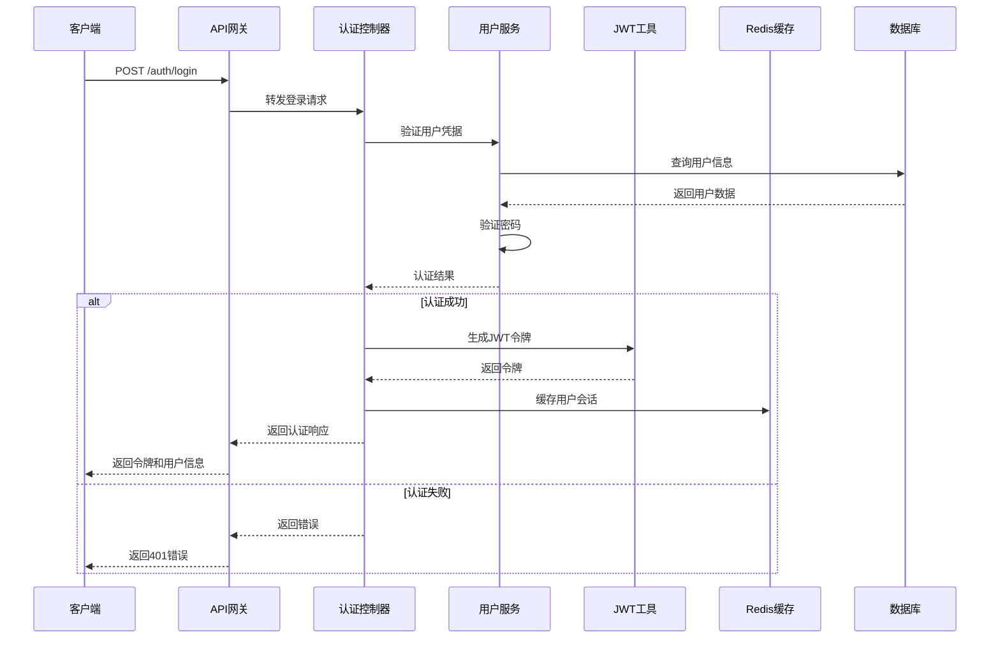

# 后端架构

## 服务架构

### 控制器组织

```
src/main/java/com/hotel/
├── controller/           # 控制器层
│   ├── auth/            # 认证相关
│   │   ├── AuthController.java
│   │   └── UserController.java
│   ├── hotel/           # 酒店相关
│   │   └── HotelController.java
│   ├── room/            # 房间相关
│   │   ├── RoomController.java
│   │   └── RoomTypeController.java
│   ├── order/           # 订单相关
│   │   └── OrderController.java
│   ├── review/          # 评价相关
│   │   └── ReviewController.java
│   └── file/            # 文件相关
│       └── FileController.java
├── service/             # 服务层
├── repository/          # 数据访问层
├── entity/              # 实体类
├── dto/                 # 数据传输对象
├── config/              # 配置类
├── util/                # 工具类
└── exception/           # 异常处理
```

### 控制器模板

```java
// controller/room/RoomController.java
@RestController
@RequestMapping("/v1/rooms")
@Validated
@Slf4j
public class RoomController {

    private final RoomService roomService;

    public RoomController(RoomService roomService) {
        this.roomService = roomService;
    }

    @GetMapping("/search")
    @Operation(summary = "搜索可用房间", description = "根据条件搜索可用房间")
    public ResponseEntity<ApiResponse<RoomSearchResponse>> searchRooms(
            @Valid @RequestBody RoomSearchRequest request) {

        log.info("搜索房间，条件：{}", request);

        RoomSearchResponse response = roomService.searchAvailableRooms(request);

        return ResponseEntity.ok(ApiResponse.success(response));
    }

    @GetMapping("/{id}")
    @Operation(summary = "获取房间详情", description = "根据ID获取房间详细信息")
    public ResponseEntity<ApiResponse<Room>> getRoomById(
            @PathVariable @Min(1) Long id) {

        log.info("获取房间详情，ID：{}", id);

        Room room = roomService.getRoomById(id);

        return ResponseEntity.ok(ApiResponse.success(room));
    }

    @PutMapping("/{id}")
    @PreAuthorize("hasRole('ADMIN')")
    @Operation(summary = "更新房间信息", description = "管理员更新房间信息")
    public ResponseEntity<ApiResponse<Room>> updateRoom(
            @PathVariable @Min(1) Long id,
            @Valid @RequestBody UpdateRoomRequest request) {

        log.info("更新房间信息，ID：{}，数据：{}", id, request);

        Room room = roomService.updateRoom(id, request);

        return ResponseEntity.ok(ApiResponse.success(room));
    }

    @GetMapping("/hotel/{hotelId}")
    @Operation(summary = "获取酒店房间列表", description = "获取指定酒店的所有房间")
    public ResponseEntity<ApiResponse<PageResult<Room>>> getHotelRooms(
            @PathVariable @Min(1) Long hotelId,
            @RequestParam(defaultValue = "0") int page,
            @RequestParam(defaultValue = "20") int size,
            @RequestParam(required = false) String status) {

        log.info("获取酒店房间列表，酒店ID：{}，页码：{}，大小：{}，状态：{}",
                hotelId, page, size, status);

        PageResult<Room> result = roomService.getHotelRooms(hotelId, page, size, status);

        return ResponseEntity.ok(ApiResponse.success(result));
    }
}
```

## 数据库架构

### 模式设计

```sql
-- 已在上面的数据库架构部分定义完整的SQL脚本
```

### 数据访问层

```java
// repository/RoomRepository.java
@Repository
public interface RoomRepository extends MybatisPlusMapper<Room> {

    @Select("SELECT r.*, rt.name as room_type_name, rt.capacity as room_type_capacity " +
            "FROM rooms r " +
            "LEFT JOIN room_types rt ON r.room_type_id = rt.id " +
            "WHERE r.hotel_id = #{hotelId} " +
            "AND r.status = #{status} " +
            "AND r.id NOT IN (" +
            "  SELECT o.room_id FROM orders o " +
            "  WHERE o.status IN ('CONFIRMED', 'COMPLETED') " +
            "  AND ((o.check_in_date <= #{checkOutDate} AND o.check_out_date > #{checkInDate}) " +
            "       OR (o.check_in_date < #{checkOutDate} AND o.check_out_date >= #{checkOutDate}))" +
            ")")
    List<RoomWithTypeInfo> findAvailableRooms(
            @Param("hotelId") Long hotelId,
            @Param("checkInDate") LocalDate checkInDate,
            @Param("checkOutDate") LocalDate checkOutDate,
            @Param("status") String status
    );

    @Select("SELECT r.*, rt.name as room_type_name, rt.capacity as room_type_capacity " +
            "FROM rooms r " +
            "LEFT JOIN room_types rt ON r.room_type_id = rt.id " +
            "WHERE r.hotel_id = #{hotelId} " +
            "AND (#{roomTypeId} IS NULL OR r.room_type_id = #{roomTypeId}) " +
            "AND (#{status} IS NULL OR r.status = #{status}) " +
            "ORDER BY r.floor, r.room_number")
    IPage<RoomWithTypeInfo> findHotelRooms(
            @Param("hotelId") Long hotelId,
            @Param("roomTypeId") Long roomTypeId,
            @Param("status") String status,
            Page<RoomWithTypeInfo> page
    );

    @Update("UPDATE rooms SET status = #{status}, updated_at = NOW() WHERE id = #{id}")
    int updateRoomStatus(@Param("id") Long id, @Param("status") String status);

    @Select("SELECT * FROM rooms WHERE room_number = #{roomNumber} AND hotel_id = #{hotelId}")
    Room findByRoomNumberAndHotelId(@Param("roomNumber") String roomNumber, @Param("hotelId") Long hotelId);
}
```

## 认证和授权架构

### 认证流程



### 中间件/守卫

```java
// config/SecurityConfig.java
@Configuration
@EnableWebSecurity
@EnableMethodSecurity(prePostEnabled = true)
public class SecurityConfig {

    private final JwtAuthenticationEntryPoint jwtAuthenticationEntryPoint;
    private final JwtRequestFilter jwtRequestFilter;

    public SecurityConfig(
            JwtAuthenticationEntryPoint jwtAuthenticationEntryPoint,
            JwtRequestFilter jwtRequestFilter) {
        this.jwtAuthenticationEntryPoint = jwtAuthenticationEntryPoint;
        this.jwtRequestFilter = jwtRequestFilter;
    }

    @Bean
    public SecurityFilterChain filterChain(HttpSecurity http) throws Exception {
        http.csrf(csrf -> csrf.disable())
            .sessionManagement(session -> session.sessionCreationPolicy(SessionCreationPolicy.STATELESS))
            .authorizeHttpRequests(authz -> authz
                .requestMatchers("/v1/auth/**").permitAll()
                .requestMatchers("/v1/hotels").permitAll()
                .requestMatchers("/v1/rooms/search").permitAll()
                .requestMatchers("/v1/reviews").permitAll()
                .requestMatchers(HttpMethod.GET, "/v1/rooms/**").permitAll()
                .requestMatchers("/v1/admin/**").hasRole("ADMIN")
                .anyRequest().authenticated()
            )
            .exceptionHandling(ex -> ex.authenticationEntryPoint(jwtAuthenticationEntryPoint))
            .addFilterBefore(jwtRequestFilter, UsernamePasswordAuthenticationFilter.class);

        return http.build();
    }

    @Bean
    public PasswordEncoder passwordEncoder() {
        return new BCryptPasswordEncoder();
    }

    @Bean
    public AuthenticationManager authenticationManager(
            AuthenticationConfiguration config) throws Exception {
        return config.getAuthenticationManager();
    }
}

// filter/JwtRequestFilter.java
@Component
@Slf4j
public class JwtRequestFilter extends OncePerRequestFilter {

    private final UserDetailsService userDetailsService;
    private final JwtUtil jwtUtil;

    public JwtRequestFilter(UserDetailsService userDetailsService, JwtUtil jwtUtil) {
        this.userDetailsService = userDetailsService;
        this.jwtUtil = jwtUtil;
    }

    @Override
    protected void doFilterInternal(
            HttpServletRequest request,
            HttpServletResponse response,
            FilterChain chain) throws ServletException, IOException {

        final String authorizationHeader = request.getHeader("Authorization");

        String username = null;
        String jwt = null;

        if (authorizationHeader != null && authorizationHeader.startsWith("Bearer ")) {
            jwt = authorizationHeader.substring(7);
            try {
                username = jwtUtil.extractUsername(jwt);
            } catch (IllegalArgumentException e) {
                log.error("无法获取JWT令牌", e);
            } catch (ExpiredJwtException e) {
                log.error("JWT令牌已过期", e);
            }
        }

        if (username != null && SecurityContextHolder.getContext().getAuthentication() == null) {
            UserDetails userDetails = this.userDetailsService.loadUserByUsername(username);

            if (jwtUtil.validateToken(jwt, userDetails)) {
                UsernamePasswordAuthenticationToken authenticationToken =
                        new UsernamePasswordAuthenticationToken(
                                userDetails, null, userDetails.getAuthorities());
                authenticationToken.setDetails(new WebAuthenticationDetailsSource().buildDetails(request));
                SecurityContextHolder.getContext().setAuthentication(authenticationToken);
            }
        }

        chain.doFilter(request, response);
    }
}
```
