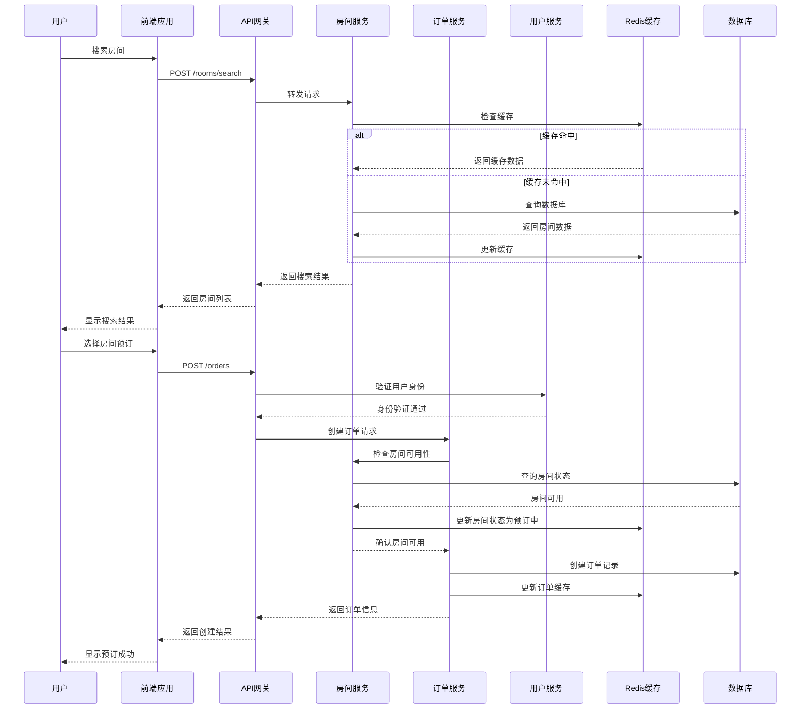
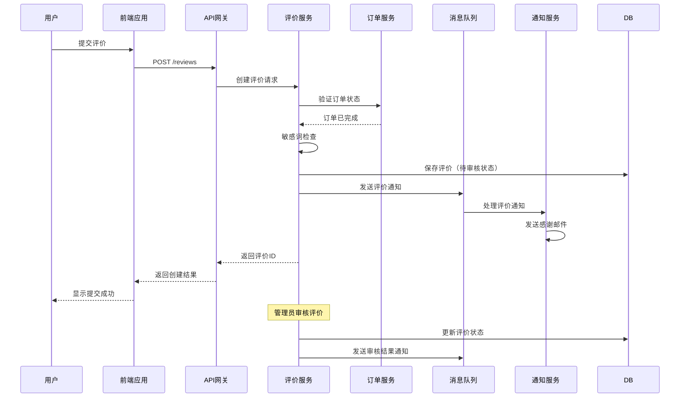

# 核心工作流

## 用户预订流程

```mermaid
sequenceDiagram
    participant User as 用户
    participant Frontend as 前端应用
    participant Gateway as API网关
    participant RoomService as 房间服务
    participant OrderService as 订单服务
    participant UserService as 用户服务
    participant Cache as Redis缓存
    participant DB as 数据库

    User->>Frontend: 搜索房间
    Frontend->>Gateway: POST /rooms/search
    Gateway->>RoomService: 转发请求
    RoomService->>Cache: 检查缓存
    alt 缓存命中
        Cache-->>RoomService: 返回缓存数据
    else 缓存未命中
        RoomService->>DB: 查询数据库
        DB-->>RoomService: 返回房间数据
        RoomService->>Cache: 更新缓存
    end
    RoomService-->>Gateway: 返回搜索结果
    Gateway-->>Frontend: 返回房间列表
    Frontend-->>User: 显示搜索结果

    User->>Frontend: 选择房间预订
    Frontend->>Gateway: POST /orders
    Gateway->>UserService: 验证用户身份
    UserService-->>Gateway: 身份验证通过
    Gateway->>OrderService: 创建订单请求
    OrderService->>RoomService: 检查房间可用性
    RoomService->>DB: 查询房间状态
    DB-->>RoomService: 房间可用
    RoomService->>Cache: 更新房间状态为预订中
    RoomService-->>OrderService: 确认房间可用
    OrderService->>DB: 创建订单记录
    OrderService->>Cache: 更新订单缓存
    OrderService-->>Gateway: 返回订单信息
    Gateway-->>Frontend: 返回创建结果
    Frontend-->>User: 显示预订成功
```

## 用户评价流程

```mermaid
sequenceDiagram
    participant User as 用户
    participant Frontend as 前端应用
    participant Gateway as API网关
    participant ReviewService as 评价服务
    participant OrderService as 订单服务
    participant MessageQueue as 消息队列
    participant NotificationService as 通知服务

    User->>Frontend: 提交评价
    Frontend->>Gateway: POST /reviews
    Gateway->>ReviewService: 创建评价请求
    ReviewService->>OrderService: 验证订单状态
    OrderService-->>ReviewService: 订单已完成
    ReviewService->>ReviewService: 敏感词检查
    ReviewService->>DB: 保存评价（待审核状态）
    ReviewService->>MessageQueue: 发送评价通知
    MessageQueue->>NotificationService: 处理评价通知
    NotificationService->>NotificationService: 发送感谢邮件
    ReviewService-->>Gateway: 返回评价ID
    Gateway-->>Frontend: 返回创建结果
    Frontend-->>User: 显示提交成功

    Note over ReviewService: 管理员审核评价
    ReviewService->>DB: 更新评价状态
    ReviewService->>MessageQueue: 发送审核结果通知
```
