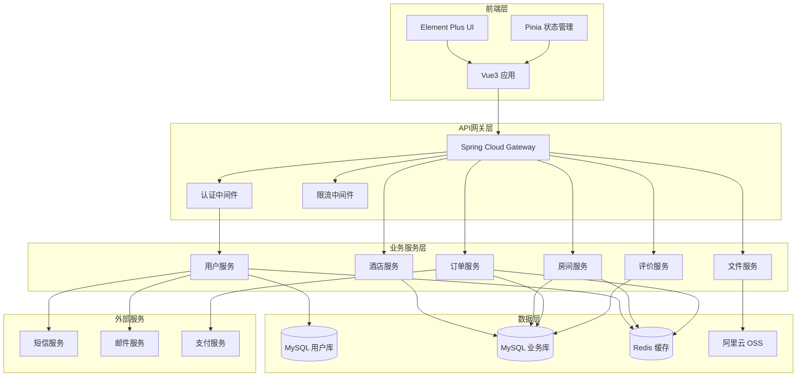

# 组件

## 用户服务 (User Service)

**职责：** 处理用户注册、登录、认证和用户信息管理

**关键接口：**
- POST /auth/register - 用户注册
- POST /auth/login - 用户登录
- GET /users/me - 获取当前用户信息
- PUT /users/me - 更新用户信息
- POST /auth/logout - 用户登出

**依赖：** MySQL数据库、Redis缓存、短信服务、邮件服务

**技术栈：** Spring Boot + Spring Security + JWT + MyBatis Plus

## 酒店服务 (Hotel Service)

**职责：** 管理酒店信息、设施配置和基础数据

**关键接口：**
- GET /hotels - 获取酒店列表
- POST /hotels - 创建酒店
- GET /hotels/{id} - 获取酒店详情
- PUT /hotels/{id} - 更新酒店信息
- DELETE /hotels/{id} - 删除酒店

**依赖：** MySQL数据库、OSS对象存储

**技术栈：** Spring Boot + MyBatis Plus + 阿里云OSS

## 房间服务 (Room Service)

**职责：** 管理房间信息、房间类型和库存状态

**关键接口：**
- GET /hotels/{hotelId}/rooms - 获取酒店房间列表
- POST /rooms/search - 搜索可用房间
- GET /rooms/{id} - 获取房间详情
- PUT /rooms/{id} - 更新房间状态
- POST /room-types - 创建房间类型

**依赖：** MySQL数据库、Redis缓存（房间状态缓存）

**技术栈：** Spring Boot + MyBatis Plus + Redis

## 订单服务 (Order Service)

**职责：** 处理预订订单、订单状态管理和支付集成

**关键接口：**
- GET /orders - 获取用户订单列表
- POST /orders - 创建订单
- GET /orders/{id} - 获取订单详情
- PUT /orders/{id} - 更新订单
- DELETE /orders/{id} - 取消订单

**依赖：** MySQL数据库、Redis缓存、支付服务（未来扩展）

**技术栈：** Spring Boot + MyBatis Plus + 分布式锁

## 评价服务 (Review Service)

**职责：** 管理用户评价、评分统计和评价审核

**关键接口：**
- GET /reviews - 获取评价列表
- POST /reviews - 提交评价
- GET /reviews/{id} - 获取评价详情
- PUT /reviews/{id}/status - 更新评价状态
- GET /reviews/statistics/{hotelId} - 获取酒店评价统计

**依赖：** MySQL数据库、消息队列（异步处理）

**技术栈：** Spring Boot + MyBatis Plus + RabbitMQ

## 文件服务 (File Service)

**职责：** 处理文件上传、存储和访问控制

**关键接口：**
- POST /files/upload - 文件上传
- GET /files/{id} - 文件访问
- DELETE /files/{id} - 删除文件
- POST /files/batch - 批量文件操作

**依赖：** 阿里云OSS、CDN

**技术栈：** Spring Boot + 阿里云OSS SDK

## 组件图

