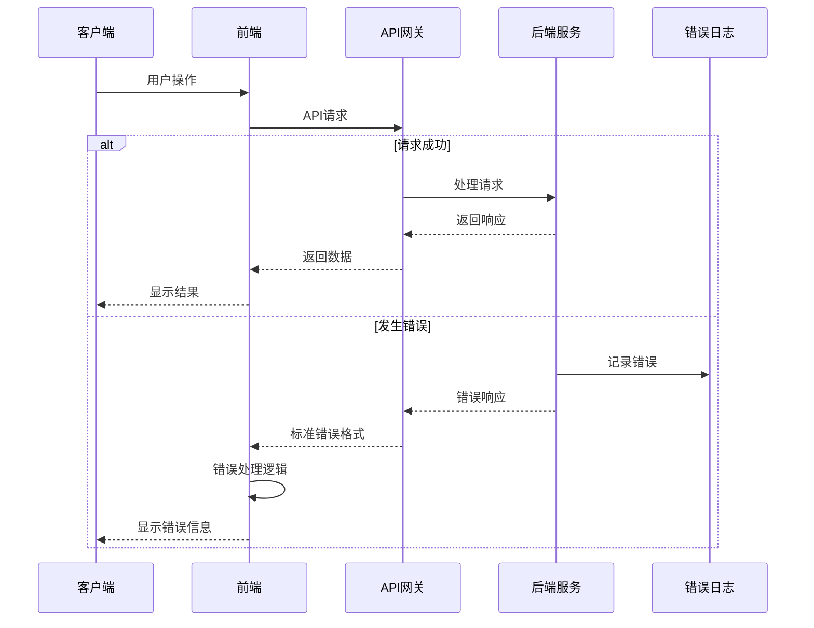

# 错误处理策略

## 错误流程



## 错误响应格式

```typescript
interface ApiError {
  error: {
    code: string;
    message: string;
    details?: Record<string, any>;
    timestamp: string;
    requestId: string;
  };
}
```

## 前端错误处理

```typescript
// utils/errorHandler.ts
export class ApiError extends Error {
  constructor(
    public code: string,
    message: string,
    public details?: Record<string, any>,
    public timestamp?: string,
    public requestId?: string
  ) {
    super(message);
    this.name = 'ApiError';
  }
}

export const handleApiError = (error: any): ApiError => {
  if (error.response?.data?.error) {
    const { code, message, details, timestamp, requestId } = error.response.data.error;
    return new ApiError(code, message, details, timestamp, requestId);
  }

  if (error.code === 'NETWORK_ERROR') {
    return new ApiError('NETWORK_ERROR', '网络连接失败，请检查网络设置');
  }

  if (error.code === 'TIMEOUT') {
    return new ApiError('TIMEOUT', '请求超时，请稍后重试');
  }

  return new ApiError('UNKNOWN_ERROR', '未知错误，请联系客服');
};
```

## 后端错误处理

```java
// exception/GlobalExceptionHandler.java
@RestControllerAdvice
@Slf4j
public class GlobalExceptionHandler {

    @ExceptionHandler(MethodArgumentNotValidException.class)
    public ResponseEntity<ApiResponse<Void>> handleValidationExceptions(
            MethodArgumentNotValidException ex) {

        Map<String, String> errors = new HashMap<>();
        ex.getBindingResult().getFieldErrors().forEach(error -> {
            errors.put(error.getField(), error.getDefaultMessage());
        });

        ErrorResponse errorResponse = ErrorResponse.builder()
                .code("VALIDATION_ERROR")
                .message("请求参数验证失败")
                .details(errors)
                .timestamp(LocalDateTime.now())
                .requestId(MDC.get("requestId"))
                .build();

        log.warn("请求参数验证失败: {}", errors);

        return ResponseEntity.badRequest()
                .body(ApiResponse.error(errorResponse));
    }

    @ExceptionHandler(BusinessException.class)
    public ResponseEntity<ApiResponse<Void>> handleBusinessException(
            BusinessException ex) {

        ErrorResponse errorResponse = ErrorResponse.builder()
                .code(ex.getCode())
                .message(ex.getMessage())
                .timestamp(LocalDateTime.now())
                .requestId(MDC.get("requestId"))
                .build();

        log.warn("业务异常: {} - {}", ex.getCode(), ex.getMessage());

        return ResponseEntity.status(ex.getHttpStatus())
                .body(ApiResponse.error(errorResponse));
    }

    @ExceptionHandler(Exception.class)
    public ResponseEntity<ApiResponse<Void>> handleGenericException(
            Exception ex) {

        String requestId = MDC.get("requestId");

        ErrorResponse errorResponse = ErrorResponse.builder()
                .code("INTERNAL_SERVER_ERROR")
                .message("系统内部错误，请稍后重试")
                .timestamp(LocalDateTime.now())
                .requestId(requestId)
                .build();

        log.error("系统内部错误 - RequestId: {}", requestId, ex);

        return ResponseEntity.status(HttpStatus.INTERNAL_SERVER_ERROR)
                .body(ApiResponse.error(errorResponse));
    }
}

// exception/BusinessException.java
public class BusinessException extends RuntimeException {
    private final String code;
    private final HttpStatus httpStatus;

    public BusinessException(String code, String message) {
        this(code, message, HttpStatus.BAD_REQUEST);
    }

    public BusinessException(String code, String message, HttpStatus httpStatus) {
        super(message);
        this.code = code;
        this.httpStatus = httpStatus;
    }

    public String getCode() {
        return code;
    }

    public HttpStatus getHttpStatus() {
        return httpStatus;
    }
}
```
