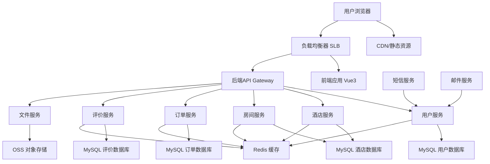

# 高层架构

## 技术摘要

本项目采用现代化的全栈架构，结合Vue3前端框架和Spring Boot后端微服务架构。前端使用组件化设计和TypeScript确保类型安全，后端采用微服务模式支持未来扩展。系统通过RESTful API进行通信，使用MySQL作为主数据库，Redis作为缓存层。部署采用Docker容器化策略，配合阿里云服务提供可靠的基础设施支持。

## 平台和基础设施选择

基于PRD性能要求（1000并发用户、99.5%可用性）和技术偏好，推荐以下平台：

**推荐选择：阿里云全栈解决方案**
- **优势：** 本土化服务、稳定可靠、完整的技术栈支持
- **成本效益：** 符合项目预算，提供免费试用额度
- **技术支持：** 丰富的文档和中文技术支持

**平台：** 阿里云
**核心服务：** ECS服务器、RDS数据库、OSS存储、Redis缓存、SLB负载均衡
**部署主机和区域：** 华东1（杭州）区域，提供稳定的网络连接

## 仓库结构

**结构：** Monorepo单体仓库
**Monorepo工具：** npm workspaces（轻量级，适合项目规模）
**包组织策略：**
- apps/：应用包（前端、后端）
- packages/：共享包（类型定义、工具函数）
- infrastructure/：基础设施代码
- docs/：项目文档

## 高层架构图

## 架构模式

- **微服务架构：** 后端采用微服务模式，每个业务域独立部署和扩展
- **组件化UI：** 前端使用Vue3组件化开发，提高代码复用和维护性
- **Repository模式：** 抽象数据访问逻辑，支持测试和数据库迁移灵活性
- **API网关模式：** 统一入口点，集中认证、限流和监控
- **CQRS模式：** 命令查询责任分离，优化复杂查询性能
- **事件驱动架构：** 服务间通过异步事件通信，提高系统解耦
- **缓存策略：** 多层缓存设计，提升系统响应速度
