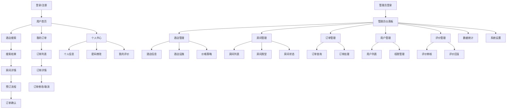
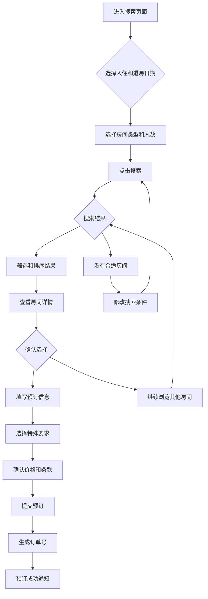
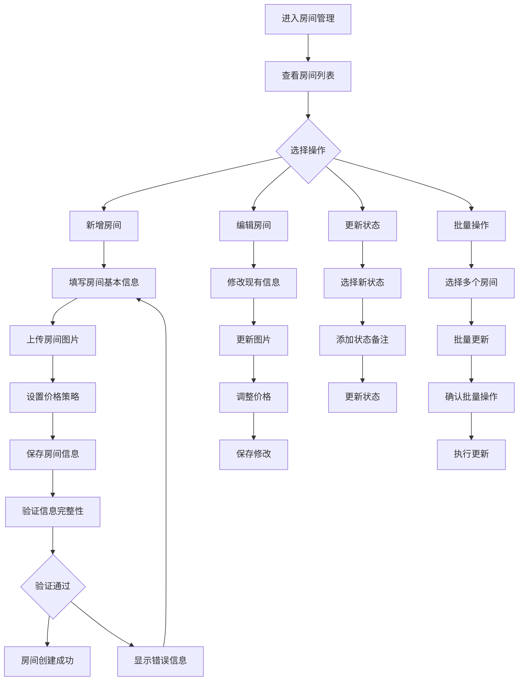
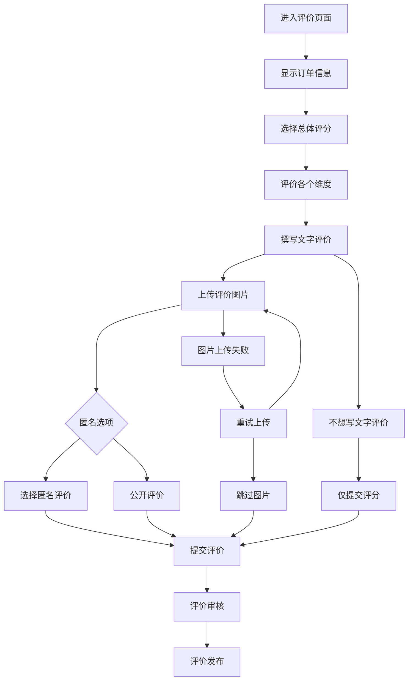

# 成都酒店综合管理系统 UI/UX Specification

## 介绍

本文档定义了成都酒店综合管理系统用户界面的用户体验目标、信息架构、用户流程和视觉设计规格。它为视觉设计和前端开发提供基础，确保协调一致且以用户为中心的体验。

## 整体UX目标与原则

### 目标用户画像

**主要用户群体：成都中小型酒店管理者**
- 年龄25-55岁，技术基础较浅，需要简洁直观的操作界面
- 关注运营效率，希望减少重复性工作
- 需要实时数据支持决策制定
- 重视系统稳定性和数据安全性

**次要用户群体：酒店住客**
- 年龄20-50岁，熟悉互联网预订流程
- 期望快速、便捷的预订体验
- 重视评价的真实性和参考价值
- 需要清晰的订单管理和状态跟踪

### 可用性目标

- **易学性：** 新用户能在5分钟内完成核心任务操作
- **使用效率：** 高频用户能够以最少的点击次数完成常用操作
- **错误预防：** 对破坏性操作提供清晰的验证和确认
- **可记忆性：** 低频用户返回时无需重新学习

### 设计原则

1. **简洁胜过复杂** - 优先考虑清晰的沟通而非美学创新
2. **渐进式展示** - 只在需要时显示所需信息
3. **一致的模式** - 在整个应用中使用熟悉的UI模式
4. **即时反馈** - 每个操作都应有清晰、即时的响应
5. **默认可访问** - 从开始就为所有用户设计

### 变更日志
| 日期 | 版本 | 描述 | 作者 |
|------|------|------|------|
| 2025-12-06 | v1.0 | 初始UX规格版本创建 | Sally (UX Expert) |

## 信息架构 (IA)

### 站点地图 / 屏幕清单

### 导航结构

**主导航：** 基于用户角色的动态导航
- 普通用户：首页、搜索、订单、个人中心
- 管理员：仪表板、酒店管理、房间管理、订单管理、用户管理、评价管理、数据统计、系统设置

**次级导航：** 上下文相关的功能导航
- 酒店管理：酒店信息、设施管理、价格策略
- 房间管理：房间列表、房间类型、状态管理
- 订单管理：订单查询、订单处理、统计分析

**面包屑策略：** 清晰的层级导航，支持快速回溯
- 格式：首页 > 模块 > 子模块 > 当前页面
- 在深层页面中始终显示，提供清晰的定位

## 用户流程

### 房间预订流程

**用户目标：** 用户能够快速找到合适的房间并完成预订

**入口点：** 首页搜索框、酒店搜索页面、房间列表页面

**成功标准：** 用户在3-5分钟内完成从搜索到预订确认的完整流程

#### 流程图

#### 边缘情况 & 错误处理：
- 房间已售罄：提供相似房间推荐或等待列表选项
- 日期冲突：清晰的日期选择器和冲突提示
- 网络错误：保存搜索条件，允许恢复操作
- 支付失败：重试机制和多种支付方式

**备注：** 预订流程采用向导式设计，每个步骤都有明确的进度指示和返回选项。

### 管理员房间管理流程

**用户目标：** 酒店管理员能够高效管理房间信息和状态

**入口点：** 管理员仪表板、房间管理菜单

**成功标准：** 管理员能在2分钟内完成房间信息更新

#### 流程图

#### 边缘情况 & 错误处理：
- 重复房间号：实时验证和友好提示
- 图片上传失败：重试机制和格式检查
- 并发编辑冲突：锁定机制和冲突解决
- 数据丢失：自动保存和恢复功能

**备注：** 支持批量操作提高效率，提供撤销功能防止误操作。

### 用户评价提交流程

**用户目标：** 用户能够方便地提交入住评价

**入口点：** 订单完成页面、我的评价页面、邮件邀请

**成功标准：** 用户能在2分钟内完成评价提交

#### 流程图

#### 边缘情况 & 错误处理：
- 敏感词过滤：实时提示和建议修改
- 图片格式不支持：格式转换或提示
- 重复评价：检查和合并评价
- 网络中断：本地保存和恢复机制

**备注：** 评价流程简化，支持渐进式提交，降低用户完成门槛。

## 线框图和原型

**主要设计文件：** 建议使用Figma创建详细的设计原型

### 关键界面布局

#### 登录/注册页面

**目的：** 提供安全、简洁的用户认证入口

**关键元素：**
- 品牌Logo和系统名称
- 登录表单（邮箱/手机号、密码）
- 注册链接和忘记密码链接
- 社交登录选项（可选）
- 记住我选项

**交互说明：**
- 实时表单验证和错误提示
- 登录按钮禁用直到验证通过
- 成功登录后的加载动画
- 错误重试机制

**设计文件参考：** 待创建

#### 房间搜索结果页面

**目的：** 帮助用户快速找到合适的房间

**关键元素：**
- 搜索条件栏（日期、人数、房型）
- 筛选器（价格、评分、设施）
- 排序选项（价格、评分、距离）
- 房间卡片列表
- 分页或无限滚动

**交互说明：**
- 实时搜索结果更新
- 筛选器联动和智能建议
- 房间卡片悬停效果
- 快速收藏功能

**设计文件参考：** 待创建

#### 管理员仪表板

**目的：** 提供系统运营概览和快速操作入口

**关键元素：**
- 关键指标卡片（今日订单、入住率、收入）
- 实时状态监控
- 快速操作按钮
- 数据趋势图表
- 最近活动列表

**交互说明：**
- 数据自动刷新机制
- 图表交互和详细查看
- 快速操作的确认对话框
- 自定义仪表板布局

**设计文件参考：** 待创建

#### 预订流程页面

**目的：** 引导用户完成房间预订

**关键元素：**
- 进度指示器
- 房间信息摘要
- 预订信息表单
- 价格明细
- 确认按钮

**交互说明：**
- 分步骤的向导式流程
- 实时价格计算
- 表单验证和错误提示
- 返回修改功能

**设计文件参考：** 待创建

## 组件库 / 设计系统

**设计系统方法：** 基于Element Plus UI框架进行定制化开发，保持一致性和开发效率

### 核心组件

#### 按钮组件 (Button)

**用途：** 用户操作的主要触发元素

**变体：**
- 主要按钮：用于主要操作（确认、提交）
- 次要按钮：用于次要操作（取消、返回）
- 文本按钮：用于辅助操作（查看详情）
- 危险按钮：用于破坏性操作（删除、取消订单）

**状态：**
- 默认状态、悬停状态、激活状态、禁用状态、加载状态

**使用指南：**
- 一个页面中主要按钮不超过一个
- 按钮文本简洁明了，使用动词开头
- 危险操作需要二次确认

#### 输入框组件 (Input)

**用途：** 用户信息输入的主要方式

**变体：**
- 标准输入框：文本、数字输入
- 搜索框：带搜索图标和清除按钮
- 密码输入框：密码可见性切换
- 多行输入框：长文本输入

**状态：**
- 默认状态、聚焦状态、错误状态、禁用状态

**使用指南：**
- 始终提供清晰的标签和占位符
- 实时验证和错误提示
- 支持键盘导航和快捷键

#### 卡片组件 (Card)

**用途：** 信息展示的容器组件

**变体：**
- 房间卡片：展示房间基本信息和操作
- 订单卡片：展示订单摘要和状态
- 统计卡片：展示数据指标
- 评价卡片：展示用户评价

**状态：**
- 默认状态、悬停状态、选中状态、禁用状态

**使用指南：**
- 信息层次清晰，避免过度拥挤
- 提供适当的间距和对齐
- 支持响应式布局

#### 表格组件 (Table)

**用途：** 结构化数据展示

**变体：**
- 标准表格：一般数据展示
- 选择表格：支持行选择
- 操作表格：包含操作列
- 分页表格：大数据量分页展示

**状态：**
- 默认状态、加载状态、空数据状态、错误状态

**使用指南：**
- 提供列排序和筛选功能
- 支持批量操作
- 移动端适配为卡片式布局

#### 导航组件 (Navigation)

**用途：** 页面间导航和层级导航

**变体：**
- 顶部导航：主导航菜单
- 侧边导航：管理后台导航
- 面包屑：层级导航
- 标签页：页面内导航

**状态：**
- 默认状态、激活状态、悬停状态、禁用状态

**使用指南：**
- 导航层级不超过3层
- 当前页面明确标识
- 支持键盘导航

## 品牌和样式指南

**视觉标识：** 基于现代简约设计风格，体现酒店行业的专业性和可信度

### 色彩方案

| 颜色类型 | 色值 | 用途 |
|---------|------|------|
| Primary | #1976D2 | 主要按钮、链接、品牌标识 |
| Secondary | #424242 | 次要按钮、文本 |
| Accent | #FF6F00 | 强调色、促销信息 |
| Success | #4CAF50 | 成功状态、确认操作 |
| Warning | #FF9800 | 警告信息、重要提醒 |
| Error | #F44336 | 错误状态、危险操作 |
| Neutral | #FAFAFA / #E0E0E0 | 背景色、分割线、边框 |

### 字体设计

#### 字体族
- **主字体：** "PingFang SC", "Helvetica Neue", Arial, sans-serif
- **次字体：** "Microsoft YaHei", "Helvetica Neue", Arial, sans-serif
- **等宽字体：** "SF Mono", Monaco, Consolas, monospace

#### 字体比例

| 元素 | 大小 | 权重 | 行高 |
|------|------|------|------|
| H1 | 32px | 600 | 1.25 |
| H2 | 24px | 600 | 1.33 |
| H3 | 20px | 600 | 1.4 |
| 正文 | 16px | 400 | 1.5 |
| 小字 | 14px | 400 | 1.43 |

### 图标设计

**图标库：** 使用Element Plus内置图标库，补充自定义业务图标

**使用指南：**
- 保持图标风格一致性
- 图标含义直观明确
- 提供hover状态的视觉反馈
- 确保在不同尺寸下的可读性

### 间距和布局

**网格系统：** 采用24px基础网格系统，8px间距单位

**间距比例：** 4px、8px、16px、24px、32px、48px、64px

**布局原则：**
- 使用一致的间距规则
- 保持视觉元素的对齐
- 合理的留白增强可读性
- 响应式布局适配不同屏幕

## 无障碍要求

### 合规目标
**标准：** WCAG 2.1 AA级别

### 关键要求

**视觉方面：**
- 颜色对比比率：正常文本至少4.5:1，大文本至少3:1
- 焦点指示器：清晰的焦点样式，2px以上的可见边框
- 文本大小：支持200%缩放而不丢失功能

**交互方面：**
- 键盘导航：所有交互元素支持键盘操作
- 屏幕阅读器支持：语义化HTML和ARIA标签
- 触摸目标：最小44px×44px的点击区域

**内容方面：**
- 替代文本：所有有意义的图片提供alt文本
- 标题结构：正确使用H1-H6标题层级
- 表单标签：所有表单控件都有明确的标签

### 测试策略
- 自动化工具测试（axe-core）
- 键盘导航测试
- 屏幕阅读器测试（NVDA、JAWS）
- 色彩对比度验证

## 响应式策略

### 断点设置

| 断点 | 最小宽度 | 最大宽度 | 目标设备 |
|------|----------|----------|----------|
| Mobile | 320px | 767px | 手机、小屏幕设备 |
| Tablet | 768px | 1023px | 平板、大屏手机 |
| Desktop | 1024px | 1439px | 桌面显示器 |
| Wide | 1440px | - | 大屏显示器 |

### 适配模式

**布局变化：**
- 移动端：单列布局，卡片式设计
- 平板端：双列布局，侧边栏可收缩
- 桌面端：多列布局，完整功能展示
- 大屏端：优化内容密度和利用空间

**导航变化：**
- 移动端：底部标签栏 + 汉堡菜单
- 平板端：侧边导航 + 顶部导航
- 桌面端：完整的侧边导航系统

**内容优先级：**
- 移动端优先显示核心功能
- 渐进式展示次要信息
- 保持操作流程的简洁性

**交互变化：**
- 移动端优化触摸交互
- 桌面端支持键盘快捷键
- 响应式表单和输入控件

## 动画和微交互

### 动画原则
- **有目的性：** 动画应该服务于用户理解，而非装饰
- **性能优先：** 保持60fps的流畅度
- **用户控制：** 尊重用户的动画偏好设置

### 关键动画

- **页面切换：** 淡入淡出效果（Duration: 300ms, Easing: ease-in-out）
- **按钮交互：** 悬停状态和点击反馈（Duration: 200ms, Easing: ease-out）
- **表单验证：** 错误提示滑入动画（Duration: 250ms, Easing: ease-in-out）
- **加载状态：** 骨架屏加载效果（Duration: 1000ms, Easing: ease-in-out）
- **模态框：** 缩放和透明度过渡（Duration: 300ms, Easing: ease-out）

## 性能考虑

### 性能目标

- **页面加载：** 首屏加载时间小于2秒
- **交互响应：** 用户操作响应时间小于100ms
- **动画帧率：** 保持60fps的流畅体验

### 设计策略

- **图片优化：** 使用WebP格式和响应式图片
- **懒加载：** 非首屏内容按需加载
- **组件复用：** 减少重复的组件定义
- **CSS优化：** 避免过度嵌套和选择器复杂度
- **字体加载：** 使用font-display优化字体加载策略

## 下一步

### 即时行动

1. 与利益相关者审查UX规格文档
2. 在设计工具中创建/更新视觉设计
3. 准备移交给设计架构师进行前端架构
4. 解决任何开放性问题或需要的决策

### 设计交接检查清单

- [ ] 所有用户流程已文档化
- [ ] 组件清单完整
- [ ] 无障碍要求已定义
- [ ] 响应式策略清晰
- [ ] 品牌指导原则已整合
- [ ] 性能目标已建立